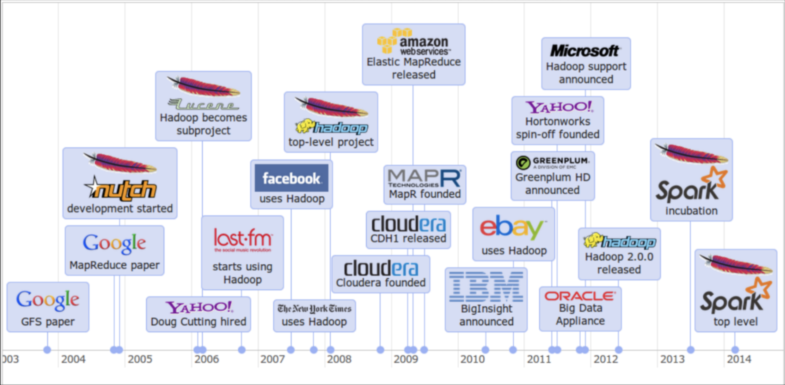
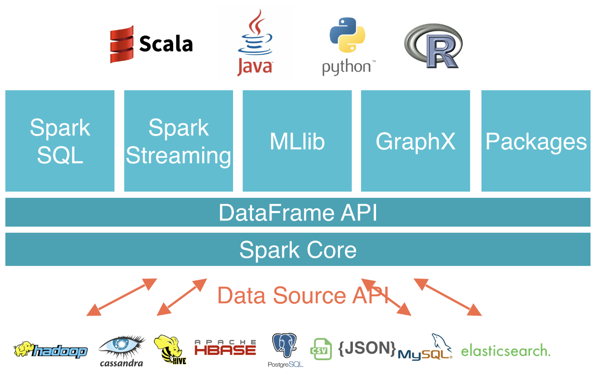
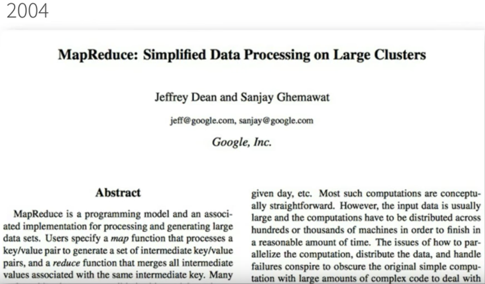
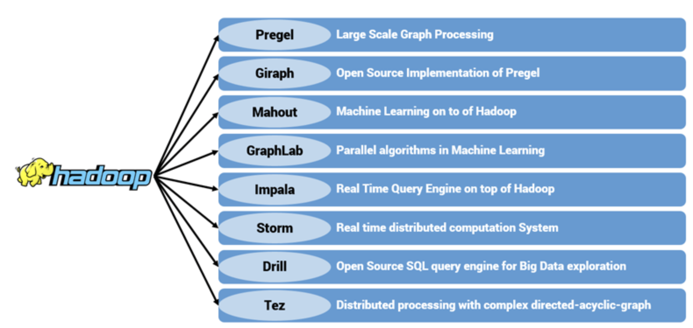
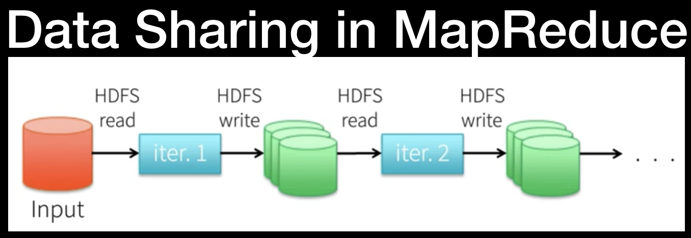
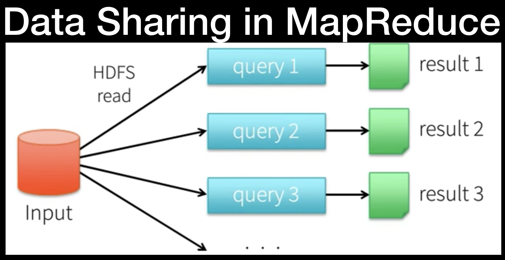
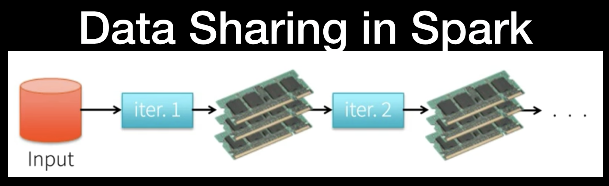
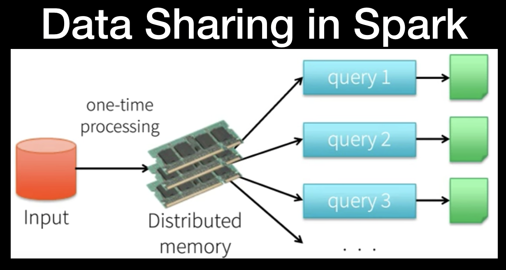

[Home](./README.md) | 
[Internet](./internet.md) | 
[AWS](./aws.md) | 
[Serverless](./serverless.md) | 
[Optional - Big Data History](./big_data_history.md) | 
[Spark Overview](./apachespark.md) | 
[Spark DataFrame API, SQL and Internals](spark-continued.md) |
<!--
[Spark Overview](./spark_overview.md).
[Spark DataFrame & SQL API](./sparkAPI.md).
[Spark Internals](./spark_internals.md).
-->
[Help/Resources](./resources.md).

## Big Data History

#### Glossary 

- [**Big Data** ](https://www.investopedia.com/terms/b/big-data.asp)

- **Cluster**: One computer works well for watching movies or working with spreadsheet software. However, there are things a computer is not powerful enough to perform - e.g data processing. Single machines do not have the power and resources to perform computations on huge amounts of information or the user does not have time to wait for the computation to finish.  A cluster or group, of computers, pools the resources of many machines together, giving us the ability to use all the cumulative resources as if they were a single computer. The cluster of machines that are used to execute tasks is managed by a cluster manager. *Spark’s own standalone cluster manager, Mesos or YARN are cluster managers*

- **Language APIs** make it possible to run code using programming languages

- **Computing Engine:**  Spark handles loading data from storage systems and performing computation on it, not being a permanent storage as the end itself. You can use Spark with a wide variety of storage systems such as Azure Storage and Amazon S3, distributed file systems such as Apache Hadoop, key-value stores such as Apache Cassandra and message buses such as Apache Kafka. However, Spark does not store data long-term itself.

- **Libraries:** builds on Spark's design as a unified engine to provide a unified API for common data analysis tasks. Spark supports standard libraries and external libraries. Spark includes libraries for SQL, and structured data SparkSQL, machine learning (MLlib), stream processing (Spark Streaming and the newer Structured Streaming), and graph analytics (GraphX). Beyond these libraries there are a hundreds of open source external libraries. (spark-packages.org)

- **Unified:** Spark is designed to support a wide range of data analytics tasks over the same computing engine and with a consistent set of APIs as real world data analytics tasks tend to combine many different processing types and libraries

- **Batch Processing** is where the processing happens of blocks of data that have already been stored over a period of time. For example, processing all the transaction that have been performed by a major financial firm in a week. This data contains millions of records for a day that can be stored as a file or record etc. This particular file will undergo processing at the end of the day for various analysis that firm wants to do. Obviously it will take large amount of time for that file to be processed. That would be what Batch Processing is

- **Stream Processing:** Stream processing allows you to process data in real time as they arrive and quickly detect conditions within small time period from the point of receiving the data. Stream processing allows you to feed data into analytics tools as soon as they get generated and get instant analytics results. Stream processing is useful for tasks like fraud detection. If you stream-process transaction data, you can detect anomalies that signal fraud in real time, then stop fraudulent transactions before they are completed.

- **Parallel Processing:** processing of program instructions by dividing them among multiple processors with the objective of running a program in less time. 


### The Big Picture 
<p align="center">
  
  </p>

Spark is a cluster computing engine that generalizes the MapReduce programming model that Google introduced back in 2004. Basically, Spark tries to support more types of applications and make them easier to program than MapReduce does. The goal was to make Spark both easy and fast to process large data sets on a cluster of machines. 

The way Spark did it:
  - **High level APIs** in languages such as Java, Scala, Python and all that are easy to program in to try to make it as similar as possible to programming on a single machine when that's possible 
  - A **unified engine** that can capture many different workloads on the same engine. So you don't have to hook together many different systems to create a pipeline. You can actually express them all in the same programming model and that's very powerful to get both faster and and easier to use processing. Thus, in terms of the unified engine what that means is that on top of the Spark engine there's a wide variety of standard libraries that are built in and these are the four shipped with the project:
  
<p align="center">
  
  </p>

- **Spark SQL** lets you work with structured data and use languages like SQL or other API's as well to query this kind of data
- **Spark Streaming** uses the engine to process and update results in real-time as new data comes in 
- **MLlib** is a library of distributed machine learning algorithms that project developers built and you can just call into
- **GraphX** is a system for graph applications

The nice thing about these is that they're all just libraries you can combine together in one program and they all translate down to the same engine underneath. 

Let's discuss why Spark was designed to have a unified engine by introducing the history of large scale cluster computing. A lot of the recent wave in data intensive computing started back in 2004 with the MapReduce paper published by Google. 

<p align="center">
  
  </p>

#### Google in this paper said (paraphrased):
> Well we have this environment that's pretty unique which is a large number of commodity servers. It's data intensive computation as opposed to just compute intensive which is what scientific supercomputing was, it automatically deals with failures, it keeps going and it's easy for users to hide applications in. And that was the MapReduce paper that was extremely influential. [You can read the research here if interested](https://static.googleusercontent.com/media/research.google.com/en//archive/mapreduce-osdi04.pdf)

One thing you may notice in the MapReduce paper though that was a very important part of it is they talked a lot about how general it was. They really liked the idea of having a general engine to do these different batch processing tasks they had. So they said: 

> We first wrote MapReduce in 2003 and since that time we have been pleasantly surprised at how badly applicable it was.

MapReduce itself only handled batch processing which was fine because that's the main thing they did at the time. So what happened after that is MapReduce became very widely deployed especially through the Hadoop implementation, which was an open source MapReduce. But users quickly wanted to do more things on the same kind of hardware and at the same kind of scale that they were using MapReduce on.

#### What MapReduce was lacking
  - More complex multi pass algorithms. MapReduce is just a single pass computation you do a map through the data then you do a reduce and you can aggregate together some values but many real-world algorithms need to go through the data many times and basically they weren't that easy or efficient to build with MapReduce.
  - More interactive ad-hoc ways, so for example, you're collecting a large data set something about visits to a website or maybe a scientific data set or something like testing out pharmaceuticals and you can on a batch job over it and compute a result in like 30 minutes and aggregate together all the data. That's really great, but then if you have a new question about it - you want to ask that question and get back the results in a few seconds if possible - so that you can actually explore it interactively. Well that's the thing that MapReduce wasn't able to do.
  - And finally users wanted to do more real-time stream processing as well so instead of for example building a web index having and updating that once per night in this way, why can't you update it in real-time as you browse, as you crawl the web and as you see new events happening, or news articles appear or stuff like that? So it's a very natural question in all of these environments.

#### The Boom in Specialized Systems
Because of these different workloads, the result was that people proposed a wide variety of specialized cluster computing systems for these workloads that are sort of the equivalent of MapReduce for streaming. And that's kind of the direction that the software went into. So basically we started this section with MapReduce that did batch processing but it was just a general engine. You could do many different types of batch processing, which was good. And then we got all these specialized systems including inside Google and also outside it. So in Google for example they developed Pregel and Dremel which were systems for graph processing and interactive queries respectively. In the open source Hadoop ecosystem, there are also a lot of open source projects with interesting names like Impala, Storm and so on that do different things. Some of them are graph processing some of them are streaming and so on. 

<p align="center">
  
  </p>

Today, you just see that there's a ton of these systems out there and people often use some kind of combination of them. With specialized systems, even though they solve the individual problems that they tackle, there are also some challenges with having them. 

#### Challenges of specialized systems:
- If you have a lot of specialized systems that you need to hook together to build an application, it's a lot of different pieces of software to manage to tune and configure to deploy to upgrade and so on. So it's a lot of operational overhead. You need to be an expert not just in one thing but in all of these different systems which have their own kind of stuff as to how they run. 
- You can't easily combine different types of processing and that's a problem because most big data applications actually need to do that. They need to combine many different processing steps to actually clean up the data and bring it into a form that you can do interesting analytics on, and then maybe serve the results or apply it to something in real time. So as a really simple example, you might collect a bunch of data and then you may want to load a subset of the data with SQL and then on a machine learning algorithm on the result. 

#### Non-trivial cost
And with the systems discussed above, there would be two different systems, and you'd need to figure out, okay well
- How do I run SQL in one of them
- How do I export it into a format that the second one can read
- How do I then query it? 
It's both difficult to use as a user and it's also inefficient because you need to move the data between these systems all the time. So in many cases actually if you measure what the computation is doing - the cost to transfer the data between these two engines is as expensive as the computation itself. And so basically this really slows down applications. 

**The reasons why big data is not-so-good to move around are:**
- expensive to copy it across the network
- expensive to write it to disk or to change the file format or any of that stuff
- often it's as expensive as actually running your algorithm on that. 

**So this is a non-trivial cost.**

#### The question that led to Spark: 
> Can we go out of this world of specialized systems and back to a single kind of general system that just captures these new workloads that motivated the previous ones?" 

And so that's what Spark tries to do. They designed a unified engine in a way that enabled different applications to be systematically captured. So how does it actually work? How did they do it?

## The Spark Programming Model
Recall 3 workloads were issues for MapReduce:
- More complex multi-pass algorithms
- More interactive ad hoc queries
- More real-time stream processing

While these all look different, it turns out all three needs one thing that MapReduce lacks: **efficient data sharing**. These are all applications where you go over a subset of the data many times or you update the result over time as new data comes in. So they're both cases where you have kind of a very hot working set of data and you need to share it effectively across many computation steps. And MapReduce didn't have this. MapReduce just had parallel operations; you add on the data but no way to do data sharing across multiple of these steps. 

### Running things on MapReduce
<p align="center">
  
  </p>
This represents the case when you want to run an iterative algorithm - so algorithm that goes through the data multiple times. What you do with MapReduce is you start with some input data in a distributed file system like **HDFS** the **Hadoop distributed file system** and then you read it into a MapReduce job (that's the blue box iteration 1). And then that job has to write the result back out to a file system because from its point of view, it's finished. All it does is compute something and write it back out. Once you've done doing that you go ahead and you immediately read it into the next job which is another MapReduce and you write it out again and so on. Between every pair of jobs you have to go through this distributed replicated file system to actually save the data to share it between the jobs and that's pretty inefficient.

<p align="center">
  
  </p>

Interactive queries have a similar problem. So you have your data in this distributed file system and then each query has to read it from their pair set and figure out the result for that query. Furthermore, all of them have to go back to the source data. There's no way to share stuff if you had some kind of intermediate result or common processing between the queries. So doing this using MapReduce and using just the file system as data sharing is slow - mostly due to replication of data across the network and disk I/O. Every time you write a result it needs to be sent across the network to many machines and and you
need to do this disk I/O to actually store it reliably.

### How Spark did it

What Spark wanted to have is a way to make this intermediate sharing much faster and it does it by replacing the sharing with just in-memory sharing. 
<p align="center">
  
  </p>

So Spark keeps the data in memory in the same process and let you run different computations on it. Spark also does it by changing the fault tolerance mechanism so that Spark doesn't have to replicate the data or save back to disk. Spark can actually do the sharing at the speed of memory instead of at the speed of a distributed file system. 
<p align="center">
  
  </p>
  
**Sharing data and memory within the same machine is easily 10 to a 100 times faster than the network or the disk**. So if your computation can keep up with that you'll get a significant speed up. 


* * *

## Apache Spark
Hopefully, now the definition is clear:

> Apache Spark is a unified computing engine and a set of libraries for parallel data processing on computer clusters that supports programming languages like R, Python, Java and Scala and libraries ranging from SQL to streaming and machine learning and runs everywhere from a laptop to a cluster of thousands of servers making it easy to scale up to big data processing or incredibly large scale.


#### Launching Spark
- Grab Spark from here: https://www.apache.org/dyn/closer.lua/spark/spark-2.4.4/spark-2.4.4-bin-hadoop2.7.tgz
- Spark runs on both Windows and UNIX-like systems (e.g. Linux, Mac OS). All you need is to have java installed on your system PATH, or the JAVA_HOME environment variable pointing to a Java installation. If you want to use the Python API, you will need a Python interpreter. If you want to use R, you will need a version of R on your machine. 

**Launching Spark:**
Open the Terminal: 
**Python:** ```./bin/pyspark``` 
**Scala:** ```./bin/spark-shell```
**SQL:** ```./bin/spark-sql```

*After you have done that type "spark" and press Enter. You will see the "SparkSession" object printed*

* * *

#### Sourcers/Credits:
To be completed
