[Home](./README.md).
[Internet](./internet.md).
[Cloud Computing](./cloud_computing.md).
[Serverless](./serverless.md).
[AWS](./aws.md).
[Spark DataFrame & SQL API](./sparkAPI.md).
[Spark Internals](./spark_internals.md).
[Advanced Optimizations in Spark](spark_optimizations.md).

## Basics of Internet. TCP/IP, Servers, Ports, Firewalls

### Protocols
- A way of communicating - more specifically, a protocol is a set of rules or conventions that computers or computer programs use while communicating with each other
- Real World Example: We shake hands, a protocol that has plenty of rules regarding length of the handshake, and the politeness of responding or not
- Computers often use protocols when they intercommunicate, in order to get data from one place to another

* * *

### How the Internet Works?
- We go “on the Internet” and visit some webpage (Facebook, Google, Amazon)
- Somehow, that webpage understands how to interpret what we want and display an appropriate output
- We can imagine that somehow, our computer puts information into the Internet, which delivers that information to some computer or server owned by the company who owns the site we’re trying to visit
- Then, this server sends back the appropriate information to the Internet, which makes sure it gets delivered to our computer at home
- In essence, the Internet is a delivery mechanism for information…but how?

* * *

### Internet Protocol address (IP address)
- Every computer on the internet has an IP (Internet Protocol) address, of the form #.#.#.# -> Four numbers separated by dots of the values 0-255
- Other IP address formats exist today as well; Like postal addresses, they uniquely identify computers on the internet
- Any device connected to the internet has an IP address, allows other computers to talk to it
- ISPs assign a IP address to your computer (router)
  - DHCP (Dynamic Host Configuration Protocol)
    - Software that ISPs provides to allow your computer to request an IP address
    - DHCP servers respond with a specific IP address for your Home
  - Multiple devices can connect to your home network  
    - The home router supports DHCP and assigns IP addresses to your devices
- IP addresses are limited
  - In the format #.#.#.#, each number is 8 bits, so 32 bits total
    - This yields 232 or about 4 billion possible addresses
    - We’re running out of addresses for all computers
  - Current version of addresses is IPv4
  - Moving towards IPv6
    - Uses 128 bits, yielding 2128 possible addresses
- How do you find your IP address?

| Mac       | Windows         | 
|:-------------|:------------------|
|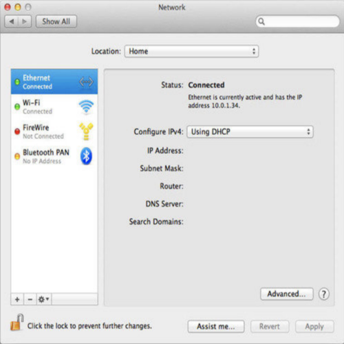| 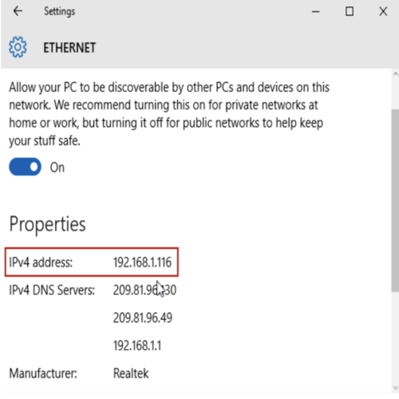 | 

- Private addresses exist
  - 10.#.#.#, 192.168.#.#, or 172.16.#.#
  - Only with special configuration can someone talk to your computer
  - Your personal device is not a server, so people should not need to access them directly
    - Your device needs to request data from servers
  - Even email is stored on a server such as Gmail and your device makes a request to that server to access that email
- Looking at advanced settings…
  - Subnet mask is used to decide if another computer is on the same network
  - Router (aka Gateway) has its own address
    - Routs data in different directions

* * *

### DNS
- We access websites using domain names (Facebook.com, Google.com, etc.), but it turns out that these sites too have IP addresses
- DNS (Domain Name System) servers convert domain names into IP addresses

* * *

### Packets
- Computers communicate by sending packets, which are like virtual envelopes sent between computers
  - Ultimately still 0s and 1s
- As an analogy, suppose we want to find a ceu_logo image on the internet
- So, we send a request to a server, say Google, like “get ceu_logo.jpg”
  - We place this request in an envelope
- On the envelope, we list out IP as the return address
- However, for the recipient of the request, we don’t know the IP address for Google
  - Have to rely on DNS
  - Send a request to our ISPs DNS server for Google’s IP address
    - If the ISP’s DNS server doesn’t know a website’s IP address, it has been configured to ask another DNS server
    - There exist root servers that know where to look to for an IP address if it exists
- After sending the request off, we’ll get a response ms later


The ceu_logo will be sent back in one or more packets
- If the ceu_logo image is too large for a single envelope, sending it in one packet could take up internet traffic
- To solve this, Google will divide the ceu_logo image into smaller fragments
  - Put the fragments into different envelopes
  - Write information on the envelopes
    - Return address: Google’s IP address
    - Delivery address: Our IP address
    - List the number of packets on each envelope (1 of 4, 2 of 4, etc.)

* * * 

### TCP/IP
- How do we make sure that data, even large amounts of data, gets to where it needs to go, and does so “fairly”, so that a single piece of data doesn’t take up more space than it should?
- How do we send the data and make sure whoever gets it knows what to do with it?
- Maybe we could label the data in order, so that the recipient knows that whichever data they get belongs in whichever order it’s supposed to
- Additionally, if some data gets lost along the way, TCP allows us to ask for the missing data and complete it
- IP goes beyond addresses
  - Set of conventions computers and servers follow to allow intercommunication
- Fragmentation like in the envelope example are supported by IP
  - If missing a packet, you can logically infer which packet you’re missing based on the ones received
    - However, IP doesn’t tell computers what to do in this case
- **TCP (Transmission Control Protocol) ensures packets can get to their destination**
  - Commonly used with IP (TCP/IP)
  - Supports sequence numbers that help data get to its destination
    - When missing a packet, a computer can make a request for the missing packet
    - The computer will put packets together to get a whole file
  - Also includes conventions for requesting services (port identifiers)
    - To make sure Google knows we’re requesting a webpage and not an email or other service

* * *

### Ports
- Per TCP, the world has standardized numbers that represent different services
- If 5.6.7.8 is Google’s IP address, 5.6.7.8;80 (port 80) lets use know that we want a webpage
  - 80 means http (hypertext transfer protocol)
    - The language that web servers speak
  - Google will send the request to their web server via http
- Many websites use secure connections with SSL or HTTPS, which uses the port 443
- Email uses port 25
- Other ports exist as well

* * * 

### UDP
- User Datagram Protocol
  - Doesn’t guarantee delivery
  - Used for video conferencing such as FaceTime
    - Packets can be dropped for the sake of keeping the conversation flowing
  - Used anytime you want to keep data coming without waiting for a buffer to fill

* * *

### Routers
- Routers have bunches if wires coming and going out of them
  - They have a big table with IP addresses and where data should be routed to get to that destination
    - Often, the data is routed to some next router
- Routers purpose is to send data in the direction of a destination
  - The next router will send it to another until it reaches a destination


The internet is a network of networks (with their own routers)
- Often multiple ways to go from A to B
  - Based in US Military logic to prevent downtime if a particular router goes down
  - When multiple packets are sent, like ceu_logo.jpg from Google, they can each take a different path, still getting to their destination eventually
    - Sometimes the internet is busy and the quickest path changes

* * *

### DHCP - Dynamic Host Configuration Protocol
- This protocol makes it so that when a computer you have - a phone, a laptop, etc - **it can announce itself and ask for an address**
- The protocol says that these devices will be assigned a numeric address
- DHCP server dynamically assigns an IP address and other network configuration parameters to each device on a network so they can communicate with other IP networks
- When my computer sends out a request, it has to use this IP address to make sure our data goes to the proper place
- However, we, as humans, don’t really read addresses like 8.8.8.8 or 192.168.0.1

### DNS
- There is a system to “translate” the human-readable domain names (google.com, facebook.com, cs50.io) to their IP address counterparts
- This service is called DNS, which allows us to use this translation to get from point A to B
- We also have routers or gateways, which know how to take in information, look at where it’s going, and send it to the proper router
- Data doesn’t have to follow the same path each time, but it will get to where it needs to go in around 30 hops or jumps from router to router or gateway to gateway

* * *

### TCP - Transmission Control Protocol
- Guarantees with high probability that data gets to where it needs to go
- Sometimes, computers drop packets (data) - they get more data than they can, or they miss it entirely
- TCP allows computers to know if they should resend data
- Port numbers, specifically TCP Port numbers, help identify which service should take which data
- For example - Data headed to #.#.#.#:80 says that the data should be sent to #.#.#.# and put through port 80, which happens to be a human-defined standard port for HTTP or web requests.

* * *

### UDP - User Datagram Protocol
- The feature here is to not guarantee redelivery….what?
- Still fairly common and appropriate
- For example, video streaming, video conferencing, live communication - we don’t want a retransmission, we would rather stay up to date chronologically
- In these cases, UDP is actually more optimal than is TCP, can you see why?

* * *

### Traceroute
**Video**
[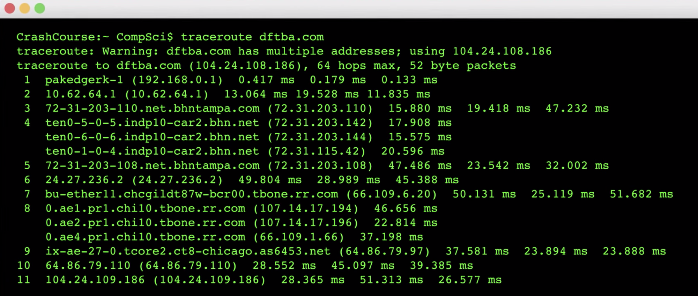](https://www.youtube.com/watch?v=AEaKrq3SpW8 "The Internet Crash Course")

- Literally traces the route that information takes from our computer to some destination
- Allows us to see which routers are being used by data to get to where it needs to go
- This route may change over time and according to web traffic patterns
- How long does it take for this process of data transfer to take on the internet?
- Traceroute is a program that sends packets to each router on a path to a destination, reporting the time it takes to reach that router
```
Mac (Terminal): traceroute domainname.com
```
```
Windows: C:\>tracert www.example.com
```
- From Sanders Theatre to Berkeley.edu:


- 6: Northern Crossroads
- 7-14: A fast connection
  - 8-9: Chicago
  - 10-11: Denver
  - 12-13: Las Vegas
  - 4: Los Angeles
- 19 is where it arrives at Berkeley in 80 ms!

**From Sanders Theatre to CNN.jp**

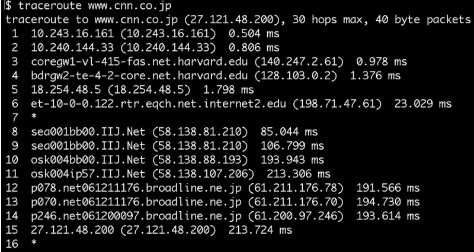

9-10 jumps from Seattle to Osaka past an ocean!
- **Using undersea cabling!**

* * * 
### Undersea Cabling

- We can also traceroute to international destinations, especially those on different continents
- There is a lot of cabling that connects locations across oceans, including the Pacific and Atlantic
- This picture is a video [Clickable Image] ("Earth looks like a MOTHERBOARD")

[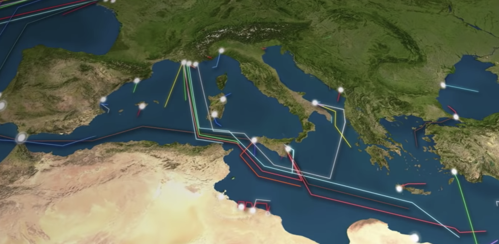](https://www.youtube.com/watch?v=IlAJJI-qG2k "Undersea Cables Power The Internet")

* * *

### HTTP - Hyper Text Transfer Protocol
- A very common protocol, which you’ve likely seen before - http://example.com
- HTTP is a sort of virtual envelope, which allows computers to communicate with one another, specifically in a webpage context (so between web browsers and servers)
- We can use nslookup to check the IP address of a web domain - i.e. nslookup www.facebook.com
- We can pretend to be a browser, and see the response that comes back when we visit a webpage
curl -I http://31.13.65.36/ - which tells us that Facebook would prefer we used their domain name (specifically which type of HTTP?)
- This returns to us the response (if it worked) 200, which means to us, and our computers, that the response was ok
- We’re likely more familiar with 404, which means things didn’t quite goes as planned
- What we see here are called headers, which give us additional information about the data we’re given

* * *

### HTML - Hyper Text Markup Language
- curl without the -I flag lets us see the HTML results, or the data
- This language tells the browser how to display everything from where pictures are located to how to format text on the page* 

**Summary:**

[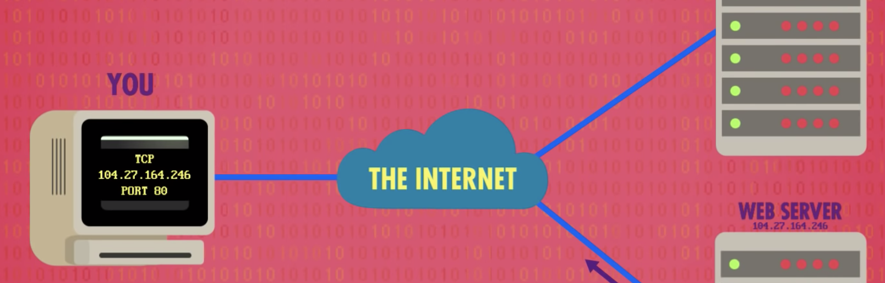](https://www.youtube.com/watch?v=guvsH5OFizE "WWW")

* * *

## Security

### Privacy
- Our data is under constant threat, but how can we defend ourselves?
- Keeping people away from things you don’t want them to see
- Computers are among the lease secure devices you own
- Data or files are stored on them as 0s and 1s
  - Can be financial info, photos, etc.

### Cookies
- A feature supported by HTTP
- Little values a web server puts on a user’s browser
- Used to remember if a user has visited a website before
  - Allows you to not have to log in every time you visit or refresh a page
    - When you log into a web server, a cookie is planted on your browser
  - Stored in a database
  - Browser will send value to web server to remind of previous login
- When we make a request we send:
```
GET / HTTP/1.1
Host: example.com
```
- We receive:
```
HTTP/1.1 200 OK
Set-Cookie: session=29823bf3-075a-433a-8754-707d05c418ab
```
  - The server gives us a cookie.
- A cookie is like an ink-based hand stamp for an amusement park or club
- Wireless information can be intercepted
  - What if a hacker could obtain the cookie
    - Session hijacking attack
    - If you have already logged in, hacker can pretend to be you
- Encryption scrambles this value so hackers cannot easily use it
- Browser history remembers everywhere you’ve been and everything you’ve done there
  - Convenient if you want to recall a website you’ve visited
    - But, so can anyone else with access to your browser
- Can clear browser history and cookies
  - History likely not securely scrubbed
  - Will protect you from nosey friends
  - Websites will forget you visited as the cookies will be deleted as well!

### Firewall

- A physical firewall is a wall between connected buildings that prevents the spread of fire
- In the world of computer science, a firewall is software that looks at IP addresses and helps keep bad guys out and user data inside
- Helps prevent people from accessing your computer

### Encryption
- Suppose I want to send a message for “HI”
- Rather than send "H-I," I'm going to send "I-J," across the internet because that is not English
  - HI ➟ IJ
  - What does he or she have to now do? 
    - Well, he or she has to know that the secret algorithm I'm using is to not only rotate letters by some number of places, but they need to know the key. 
    - The key to this algorithm is the number of places that I'm shifting letters by
    - So he or she has to know that it was just one
    - One is not that hard to just guess
    - This, then, is my so-called cipher text. And once decrypted, becomes my plain text as well. Now, it turns out this is an example of something called a **Caesar cipher**, a rotational cipher
  - The recipient needs to know how it changed to revert
- Plaintext ➟ Cyphertext ➟ Plaintext
  - HI ➟ IJ ➟ HI
- This is called a caesar cypher
  - Rotational cyphers are not that secure
    - Can be guessed easily
    - Not used for internet encryption
  - For this to work, recipient needs the **key**
    - To know the key, we need to agree in advance
    - Can’t send it encrypted as well as they need the key!

### Public Key Cryptography

- The last example with a caesar cypher is secret-key cryptography
  - Only one key
- One has to know that the secret was, in the previous case, one. 
  - Now, that's kind of a chicken and the egg problem. For him or her to know what key we're going to be using, we have to agree upon it in advance. 
  - So how do we agree upon it in advance? I can't just send them a message and write the number one on it and send it, because it would be unencrypted. So maybe I pick up the phone. I use a different technology, and I say, hey, let's use a key of one! But at that point, the story is kind of stupid for a different reason. Why don't I just tell them "hi" at that same time? 
  - Right, so if I'm already talking to them via some other channel, just give them the message. Don't worry about a key. And this is absolutely the case when you visit a website. Like, I don't really know anyone personally at amazon.com who can sell me a book. I don't really personally know anyone at Gmail who can send me my emails. I know the website gmail.com. I know the website amazon.com. 
  - And my computer certainly doesn't know another computer there. It just knows its domain name and maybe its IP address, eventually. So it turns out, what we just described, rotating characters one place, is what's called secret key cryptography.
- So secret key cryptography is predicated on keeping that key, the number one or 13 or 25 or something else, secret. 
- But there's also something called public key cryptography that satisfies this issue of chicken and egg, where you need a secret, but you can't establish a secret before you have a secret. Public key cryptography addresses this as follows:
- Whereas in the secret key scenario, you have just one key, in the public key scenario, every person has two keys. 
- One key is private, and one key is public. 
  - There's a mathematical relationship between these two values, public and private, so that you use the public key to encrypt information, but you use the private key to decrypt it, which is to say that if I have two people here, let's say Alice and Bob, Alice has her private key, we'll call it A, and her public key, public A. 
- And Bob, meanwhile, has his private key, B, and public key, B. 
- When Alice wants to send Bob a message, she sends it from A to B. And she uses Bob's public key. 
- Bob, upon receipt of that message uses his private key to decrypt it. 
- For now, let's just stipulate there's a mathematical relationship such that algorithmically, Bob's private key can undo the effects of Bob's public key. 
- Meanwhile, Bob wants to send a reply to Alice. So Bob uses Alice's public key. Alice receives the message and uses what to decrypt it? Alice's private key. And by nature of public, these keys, A and B, can literally be posted on the internet. They can be read aloud on the phone. 
- The private keys, though, meanwhile, Alice and Bob have to keep private. 
- And all of this happens automatically in today's browsers. 
- In fact, when your browser, Chrome or Edge or whatever, uses the internet to connect to amazon.com or gmail.com, your browser has its own public and private key, as does Amazon's server, as does Google and Facebook and any other website. 
  - Your browser using this crypto system, this public key cryptography mechanism, to exchange a secure message with Amazon or Google or Facebook, even though your laptop has never met anyone at those companies before. And so turns out, for efficiency, what's ultimately used later is very often secret key cryptography. 
 
**Illustration**
  
- In public key cryptography there are two keys, one public and one private
  - Mathematical relationship between them
    - Use public key to encrypt, private key to decrypt 
    
    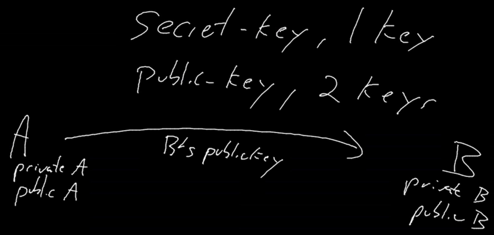
    
    - Bob’s private key can undo the effects of his public key
    - When Bob responds:
    
    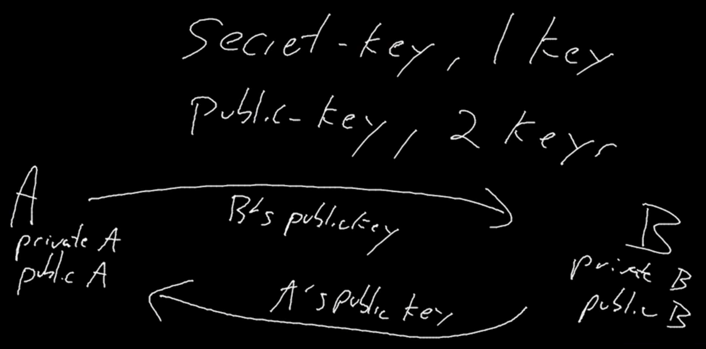
    
  - Bob sends a message using Alice’s public key
- Your browser has its own public and private keys
  - So does websites like Google and Amazon
    - This allows them to communicate securely with you
- Often this processes is used to exchange a secret key

[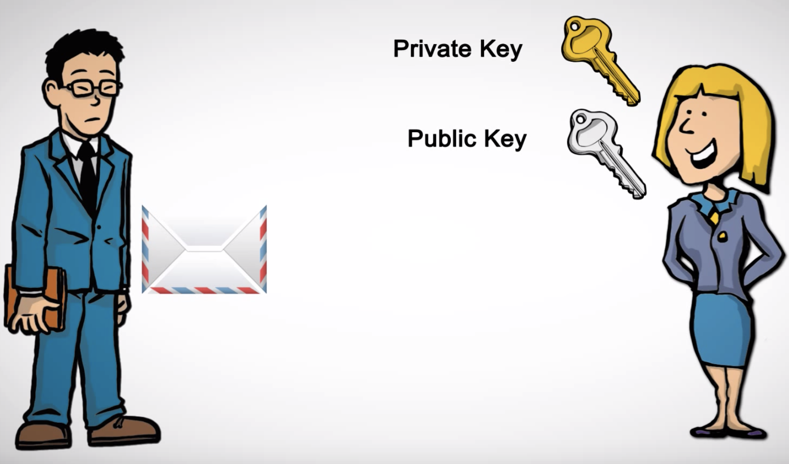](https://www.youtube.com/watch?v=i-rtxrEz_E8 "Public/Private Key")

### A Deeper Dive [Public Key Cryptography]
- Public key cryptography is used to secure web trafic through the SSL/TLS protocol that we all use when we use https:// URLs - The security this achieve is quite amazing
- Suppose you have a Mac. This Mac came pre-installed with the Apple public key which you trust to be authentic. Now, suppose that you want to communicate with Amazon.com. You might not know the correct public key for Amazon, but Apple surely does. So Apple can supply Amazon with a signed message to the effect of:

- “I Apple certify that the public key of Amazon.com is: 
```
30 82 01 0a 02 82 01 01 00 94 9f 2e fd 07 63 33 53 b1 be e5 d4 21 9d 86 43 70 0e b5 7c 45 bb ab d1 ff 1f b1 48 7b a3 4f be c7 9d 0f 5c 0b f1 dc 13 15 b0 10 e3 e3 b6 21 0b 40 b0 a3 ca af cc bf 69 fb 99 b8 7b 22 32 bc 1b 17 72 5b e5 e5 77 2b bd 65 d0 03 00 10 e7 09 04 e5 f2 f5 36 e3 1b 0a 09 fd 4e 1b 5a 1e d7 da 3c 20 18 93 92 e3 a1 bd 0d 03 7c b6 4f 3a a4 e5 e5 ed 19 97 f1 dc ec 9e 9f 0a 5e 2c ae f1 3a e5 5a d4 ca f6 06 cf 24 37 34 d6 fa c4 4c 7e 0e 12 08 a5 c9 dc cd a0 84 89 35 1b ca c6 9e 3c 65 04 32 36 c7 21 07 f4 55 32 75 62 a6 b3 d6 ba e4 63 dc 01 3a 09 18 f5 c7 49 bc 36 37 52 60 23 c2 10 82 7a 60 ec 9d 21 a6 b4 da 44 d7 52 ac c4 2e 3d fe 89 93 d1 ba 7e dc 25 55 46 50 56 3e e0 f0 8e c3 0a aa 68 70 af ec 90 25 2b 56 f6 fb f7 49 15 60 50 c8 b4 c4 78 7a 6b 97 ec cd 27 2e 88 98 92 db 02 03 01 00 01”
```
- Such a message is known as a certificate, and it allows you to extend your trust in Apple to a trust in Amazon. 
  - When your browser communicates with amazon, it can request this message, and if it is not present not continue with the interaction.
    - Clearly a person in the middle can stop this message from travelling and hence not allow the interaction to continue, but they cannot spoof the message and send a certificate for their own public key, unless they know Apple’s secret key. 
- Using certificates, we can assume that Bob the user has the public verification key 𝑣 of Alice the server. Now Alice can send Bob also a public encryption key 𝑒, which is authenticated by 𝑣 and hence guaranteed to be correct.
- Once Bob knows Alice’s public key they are in business- he can use that to send an encryption of some private key 𝑘 which they can then use for all the rest of their communication.
- Digital signatures and other forms of electronic signatures are legally binding in many jurisdictions. This is some material from the website of the electronic signing company DocuSign:

[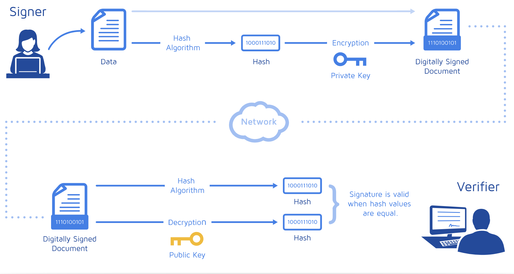](https://www.docusign.com/how-it-works/electronic-signature/digital-signature/digital-signature-faq#cert "Understanding digital signatures")


* * *
* * *


### Q&A
- **Suppose that you turn on your computer and visit https://www.ceu.edu/ in a browser. Using each of the terms below in a context that makes clear your understanding of each, explain in a paragraph the process by which CEU's home page appears on your screen: DHCP server, DNS server, IP address, packet, TCP port, web server.**
  - When I turn on my computer and connect to WiFi DHCP gives me a unique IP address and tells the IP address of the local DNS server. DNS converts domain names to IP addresses and vice versa so when I type www.ceu.edu, DNS translates it into a numeric address, the real address of the server where the website is located. Then an HTTP request is sent to the server, which sends a copy of the website (data) to me across TCP/IP. If the request gets approved then data packets will be sent to me. Then these small packets assemble and get displayed to me.
DHCP server- assigns IP addresses
DNS server - contains the IP addresses and host names (translation)
IP address: #.#.#.#, where each # is between 0 and 255. (identification & location)
Packet: unit of data
TCP port: used to identify the format that is requested. For example, port "80" requests web services, port "25" requests email, etc.
Web Server: processes incoming network requests over HTTP and other protocols


- **TCP (tries to) guarantee delivery by ensuring that any lost packets are resent. Why, though, might packets be lost between a sender and receiver?**
  - UDP: its feature is to not guarantee delivery. If some data gets lost, packets get dropped. It can be due to: malfunction, technical difficulties, overloaded routers. This protocol does not let data to be re-transmitted. Skype, streaming, video games are some examples where UDP is useful because it is better to wait a few seconds than watching something lagging all the time. Re-transmission is not as good as staying up to date chronologically. TCP: Packets can be lost here as well due to the routers being too busy or due to other reasons, but then TCP re-transmits.


- **When a server receives a packet, how does it know whether that packet contains (part of) an email, a request for a website, an instant message, or something else altogether?**
  - SMTP (protocol for emails), on the 'envelope' there will be a port number specified. We need to specify what type of information is inside the envelope, which is represented by the port number.


- **In what sense are domain names similar to phone numbers like 1-800-COLLECT?**
  - Phone number: numeric reference, phone numbers were originally hard wired and the first few numbers told the geographic location of the exchange. Phone numbers are used to identify people. Everybody has a different one. Domain name is like an address as well and helps us locate web pages. There is no duplicate domain address. (IPv6 is needed so that we do not run out of them)


- **If not already familiar, read up on "bandwidth" and "latency" (as via Google) and then, in your own words, distinguish the two concepts as they relate to internet speed.**
  - Latency is basically the time it takes to send a packet from the source to the destination. Bandwidth is the maximum data transfer rate. So high latency is not good because it takes a lot of time to get a packet from the source to the destination, but with high bandwidth, we can reduce this time.


- **How does every website that you visit know (and likely log!) your IP address?**
  - The web server needs an IP to be able to establish the connection and communicate, where to send the data requested etc. It is usually done in the NCSA format. Anonymization can be done via: Proxy, VPN, Tor, NAT, Gateway or Firewall. You'll know the following information if you know one’s IP address: approximate location based on IP/ISP, whether they have a static or dynamic IP, if they use traceroute (+ see the latency), with telnet or nmap open ports can be found as well. IP address is usually logged to show you relevant advertisements. The information is contained in the Packet Header.


- **If not already familiar, read up on "DNS hijacking," and in your own words, explain what it means for an adversary to hijack a website via DNS.**
[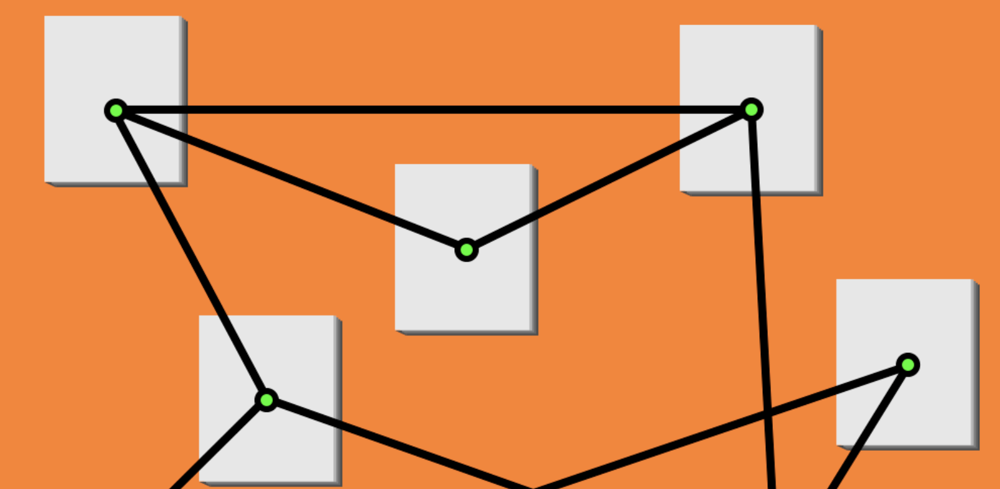](https://www.wired.com/story/what-is-dns-hijacking/ "DNS-hijacking")
  - When we open a website, DNS translates the domain to an IP and then we can access the website. DNS hijacking means to redirect requests of a specific server to another and it is achieved by the translation of a domain to a fake IP address that takes the person to a malicious website and eventually people or companies may lose data (passwords, accounts etc.). One of the most popular DNS hijacking case is when hackers redirected traffic to all 36 of a Brazilian bank's domains.
Optional Reading


* * *

### Practice Questions:
- What is the internet?
- What does it mean if a URL begins with https:// as opposed to http://?
- What does it mean for a computer to have a private IP address (e.g. one that begins with 10., 192.168., or 172.16.)?
- Why do TCP/IP packets from one computer to another not always take the same amount of time to arrive at their destination?
- Today's "home routers" are often much more than routers alone. They are also "access points" (aka APs) and "firewalls" too. What is an access point (AP)? And what is a firewall?
- Whether or not you have internet service at home, Google around for an internet service provider (ISP) that provides internet service to your neighborhood (or somewhere nearby). What's the ISP you found? What speeds does the ISP you found offer? At what cost? And do they offer symmetric (i.e., identical) upload and download speeds, or do they differ?

* * *

##### Sources:
https://www.webopedia.com/TERM/W/Web_server.html
http://web.stanford.edu/class/cs101/lecture10.html#/4
https://www.boazbarak.org/cs127spring16/chap10_public_key_intro.pdf
https://intensecrypto.org/public/lec_10_public_key_intro.html#sec-public-key-encryptions-definition
https://jhalderm.com/pub/papers/heartbleed-imc14.pdf
https://web.stanford.edu/class/cs101/network-2-internet.html
https://medium.com/@maneesha.wijesinghe1/what-happens-when-you-type-an-url-in-the-browser-and-press-enter-bb0aa2449c1a
https://cs.harvard.edu/malan/publications/
https://www.wired.com/story/what-is-dns-hijacking/
https://web.stanford.edu/class/msande91si/www-spr04/readings/week1/InternetWhitepaper.htm
https://cs50.harvard.edu/college/
https://web.stanford.edu/class/cs101/network-1-introduction.html
https://www.youtube.com/watch?v=AEaKrq3SpW8
https://www.seas.harvard.edu/academics/courses/computer-science
https://en.wikipedia.org/wiki/Caesar_cipher
https://www.youtube.com/watch?v=guvsH5OFizE
https://www.youtube.com/watch?v=IlAJJI-qG2k
https://introtcs.org/public/index.html
https://en.wikipedia.org/wiki/Dynamic_Host_Configuration_Protocol
