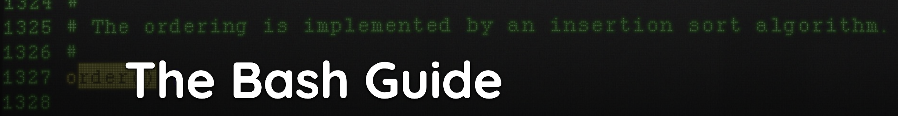
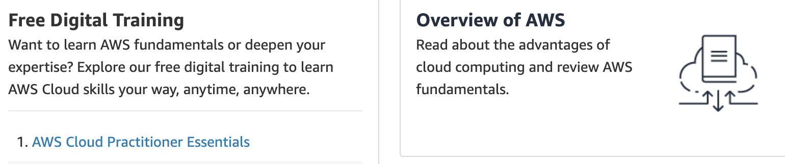

[Home](./README.md).
[Internet](./internet.md).
[Cloud Computing](./cloud_computing.md).
[Serverless](./serverless.md).
[AWS](./aws.md).
[Spark Overview](./spark_overview.md).
[Spark DataFrame & SQL API](./sparkAPI.md).
[Spark Internals](./spark_internals.md).
[Advanced Optimizations in Spark](spark_optimizations.md).
[Help/Resources](./resources.md).

#### The Bash Guide:

#### The SQL Guide:

#### The AWS Guide

#### The R Guide:
TBC
