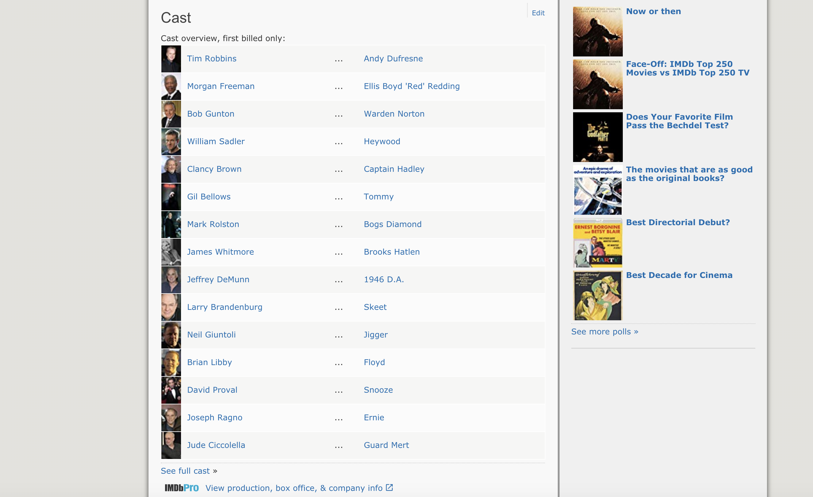
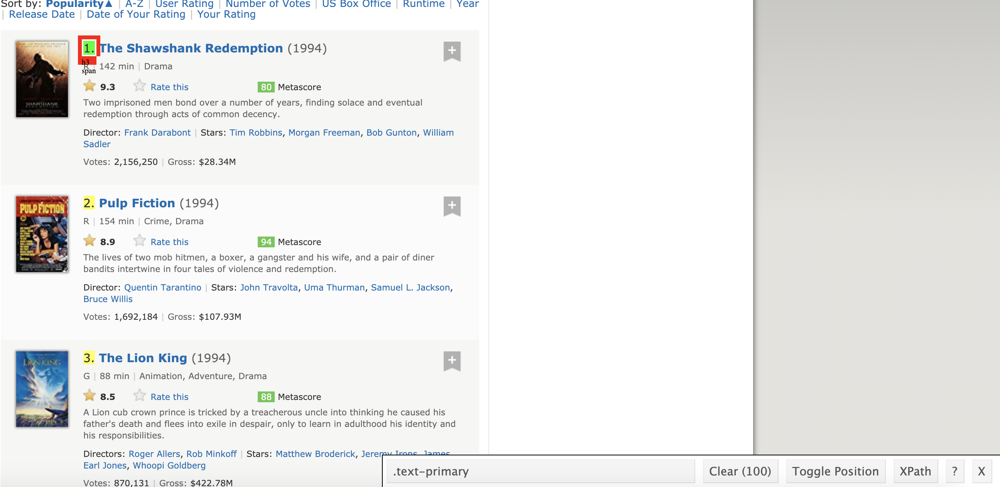
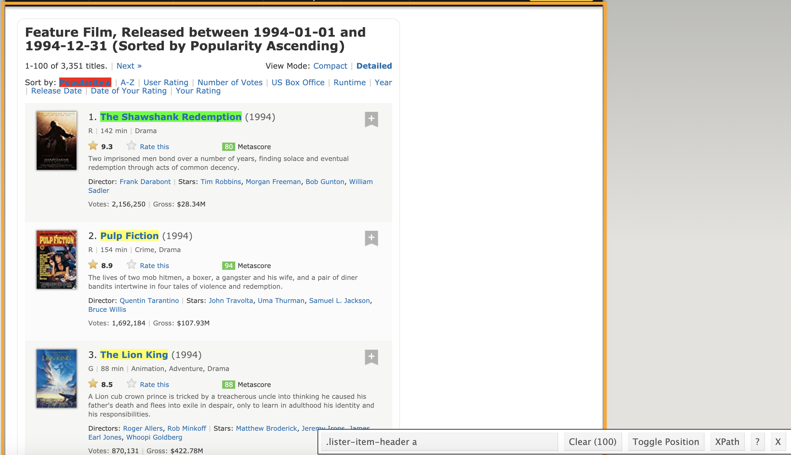
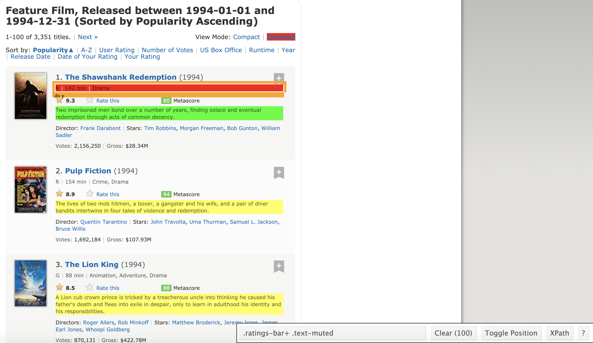
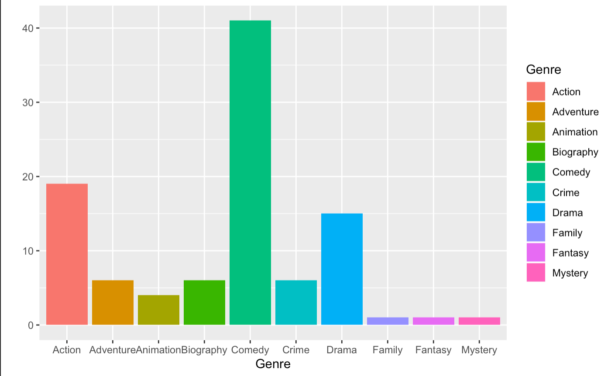
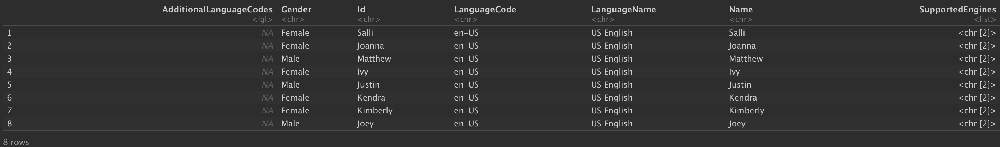
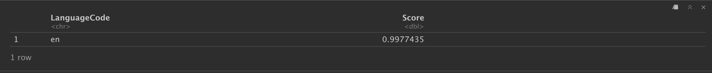
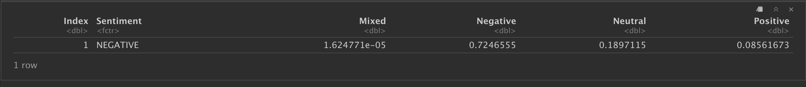
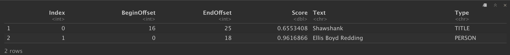
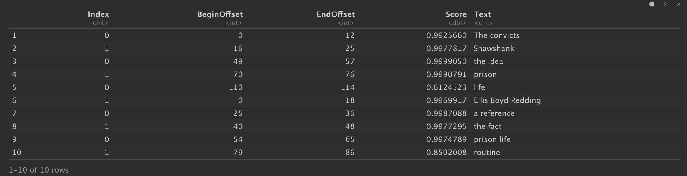

[Home](./README.md) | 
[Internet](./internet.md) | 
[AWS](./aws.md) | 
[Serverless](./serverless.md) | 
[Optional - Big Data History](./big_data_history.md) | 
[Spark Overview](./apachespark.md) | 
[Spark DataFrame API, SQL and Internals](spark-continued.md) |
<!--
[Spark Overview](./spark_overview.md).
[Spark DataFrame & SQL API](./sparkAPI.md).
[Spark Internals](./spark_internals.md).
-->
[Help/Resources](./resources.md).

### Serverless Solutions in the Cloud

### Introduction
Data on the web is growing exponentially. All of us today use Google as our first source of knowledge – be it about finding reviews about a place to understanding a new term. All the data that you need is already available on the internet – the only thing limiting you from using it is the ability to access it. However, most of the data available over the web is not readily available. It is present in an unstructured format (HTML format) and is not downloadable. Therefore, it requires knowledge & expertise to use this data to eventually build a useful model.

#### Web Scraping
Web scraping is a technique for converting the data present in unstructured format (HTML tags) over the web to the structured format which can easily be accessed and used.

#### How to Scrape?
**There are several ways of scraping data from the web. Some of the popular ways are:**

- Human Copy-Paste: This is a slow and efficient way of scraping data from the web. This involves humans themselves analyzing and copying the data to local storage.

- Text pattern matching: Another simple yet powerful approach to extract information from the web is by using regular expression matching facilities of programming languages.

- API Interface: Many websites like Facebook, Twitter, LinkedIn, etc. provides public and/ or private APIs which can be called using the standard code for retrieving the data in the prescribed format.

- DOM Parsing: By using web browsers, programs can retrieve the dynamic content generated by client-side scripts. It is also possible to parse web pages into a DOM tree, based on which programs can retrieve parts of these pages. *We are going to use this.*

#### [Web Scraping Demo](https://github.com/tidyverse/rvest/tree/master/demo)
```r

library(rvest)
the_shawshank_redemption <- read_html("https://www.imdb.com/title/tt0111161/")

cast <- the_shawshank_redemption %>%
  html_nodes("#titleCast .primary_photo img") %>%
  html_attr("alt")
cast

```
**Output:** 
 [1] "Tim Robbins" "Morgan Freeman" "Bob Gunton" "William Sadler" "Clancy Brown"  "Gil Bellows"  "Mark Rolston" [8] "James Whitmore" "Jeffrey DeMunn" "Larry Brandenburg" "Neil Giuntoli" "Brian Libby"  "David Proval" "Joseph Ragno"  [15] "Jude Ciccolella"   



### rvest
- rvest is package that makes it easy to scrape data from html web pages, inspired by libraries like beautifulsoup (bs4). You can express complex operations as elegant pipelines composed of simple, easily understood pieces. rvest is built upon the xml2 package and also accept config from the httr package. For the most part, we only need rvest. However, we need httr if we want to add extra configurations.

**Make sure you have this package installed**
```r
install.packages("rvest")
```

```r
install.packages("httr")
```

- We will be using an open source software named Selector Gadget which will be more than sufficient for anyone in order to perform Web scraping. You can access and **download the Selector Gadget extension** [here](https://selectorgadget.com/). Make sure that you have this extension installed by following the instructions from the website. 

>Using this you can select the parts of any website and get the relevant tags to get access to that part by simply clicking on that part of the website. Note that, this is a way around to actually learning HTML & CSS and doing it manually. But to master the art of Web scraping, I’ll highly recommend you to learn HTML & CSS in order to better understand and appreciate what’s happening under the hood.


## Web Scraping Example
```r

#Loading the rvest package
library(rvest)

#Specifying the url for desired website to be scraped
url <- 'https://www.imdb.com/search/title/?count=100&release_date=1994,1994&title_type=feature'

#Reading the HTML code from the website
webpage <- read_html(url)

```

**Now let's scrape IMDB:**
- *Rank:* The rank of the film from 1 to 100 on the list of 100 most popular feature films released in 1994
- *Title:* The title of the feature film.
- *Description:* The description of the feature film.
- *Runtime:* The duration of the feature film.
- *Genre:* The genre of the feature film,
- *Rating:* The IMDb rating of the feature film.
- *Director:* The main director of the feature film. Note, in case of multiple directors, I’ll take only the first.
- *Actor:* The main actor in the feature film. Note, in case of multiple actors, I’ll take only the first.

#### STEP 0: Check Robots.txt

https://www.imdb.com/robots.txt

Good bots comply to the rules set by websites in their robots.txt file and follow best practices while crawling and scraping. 

#### STEP 1: Scraping the Rank field
For that, we’ll use the selector Google Chrome extension gadget that you've downloaded already to get the specific CSS selectors that encloses the rankings. You can click on the extension in your browser and select the rankings field with the cursor. 

Make sure that all the rankings are selected. You can select some more ranking sections in case you are not able to get all of them and you can also de-select them by clicking on the selected section to make sure that you only have those sections highlighted that you want to scrape for that go.



Once you are sure that you have made the right selections, you need to copy the corresponding CSS selector.
```r
#Using CSS selectors to scrape the rankings section
rank_data_html <- html_nodes(webpage,'.text-primary')

#Converting the ranking data to text
rank_data <- html_text(rank_data_html)

#Data-Preprocessing: Converting rankings to numerical
rank_data<-as.numeric(rank_data)

#Let's have a look at the rankings
head(rank_data)

```
*Output: 1, 2, 3, 4, 5, 6*

#### STEP 2: Scraping the title field. 
Again, I have the corresponding CSS selector for the titles – .lister-item-header a. I will use this selector to scrape all the titles using the following code.
```r
#Using CSS selectors to scrape the title section
title_data_html <- html_nodes(webpage,'.lister-item-header a')

#Converting the title data to text
title_data <- html_text(title_data_html)

#Let's have a look at the title
head(title_data)

```
*Output: "The Shawshank Redemption" "Pulp Fiction" "The Lion King" "Forrest Gump" " Léon: The Professional" " Interview with the Vampire: The Vampire Chronicles"*



#### STEP 2: Scraping the title description. 
```r
#Using CSS selectors to scrape the description section
description_data_html <- html_nodes(webpage,'.ratings-bar+ .text-muted')

#Converting the description data to text
description_data <- html_text(description_data_html)

#Data-Preprocessing: removing '\n'
description_data<-gsub("\n","",description_data)

#Let's have a look at the description data
head(description_data)
```
*Output: [1] "    Two imprisoned men bond over a number of years, finding solace and eventual redemption through acts of common decency."                                                                                          
[2] "    The lives of two mob hitmen, a boxer, a gangster and his wife, and a pair of diner bandits intertwine in four tales of violence and redemption."                                                                 
[3] "    A Lion cub crown prince is tricked by a treacherous uncle into thinking he caused his father's death and flees into exile in despair, only to learn in adulthood his identity and his responsibilities."         
[4] "    The presidencies of Kennedy and Johnson, the events of Vietnam, Watergate, and other history unfold through the perspective of an Alabama man with an IQ of 75."                                                 
[5] "    Mathilda, a 12-year-old girl, is reluctantly taken in by Léon, a professional assassin, after her family is murdered. An unusual relationship forms as she becomes his protégée and learns the assassin's trade."
[6] "    A vampire tells his epic life story: love, betrayal, loneliness, and hunger."*



#### STEP 3: Scraping the runtime field. 
```r
#Using CSS selectors to scrape the Movie runtime section
runtime_data_html <- html_nodes(webpage,'.text-muted .runtime')

#Converting the runtime data to text
runtime_data <- html_text(runtime_data_html)

#Data-Preprocessing: removing mins and converting it to numerical

runtime_data<-gsub(" min","",runtime_data)
runtime_data<-as.numeric(runtime_data)

#Let's have a look at the runtime
head(runtime_data)

```
*Output: 142 154  88 142 110 123*

#### STEP 4: Scraping the genre field. 
```r
#Using CSS selectors to scrape the Movie genre section
genre_data_html <- html_nodes(webpage,'.genre')

#Converting the genre data to text
genre_data <- html_text(genre_data_html)

#Data-Preprocessing: removing \n
genre_data<-gsub("\n","",genre_data)

#Data-Preprocessing: removing excess spaces
genre_data<-gsub(" ","",genre_data)

#taking only the first genre of each movie
genre_data<-gsub(",.*","",genre_data)

#Convering each genre from text to factor
genre_data<-as.factor(genre_data)

#Let's have another look at the genre data
head(genre_data)

```
*Output:  Drama     Crime     Animation Drama     Action    Drama    
Levels: Action Adventure Animation Biography Comedy Crime Drama Family Fantasy Mystery*

#### STEP 5: Scraping the rating field. 
```r
#Using CSS selectors to scrape the IMDB rating section
rating_data_html <- html_nodes(webpage,'.ratings-imdb-rating strong')

#Converting the ratings data to text
rating_data <- html_text(rating_data_html)

#Data-Preprocessing: converting ratings to numerical
rating_data<-as.numeric(rating_data)

#Let's have another look at the ratings data
head(rating_data)

```
*Output: 9.3 8.9 8.5 8.8 8.5 7.6*

#### STEP 6: Scraping the Director field. 
```r
#Using CSS selectors to scrape the directors section
directors_data_html <- html_nodes(webpage,'.text-muted+ p a:nth-child(1)')

#Converting the directors data to text
directors_data <- html_text(directors_data_html)

#Data-Preprocessing: converting directors data into factors
directors_data<-as.factor(directors_data)

#Let's have a look at the directors data
head(directors_data)
```
*Output: Frank Darabont    Quentin Tarantino Roger Allers      Robert Zemeckis   Luc Besson        Neil Jordan*      
*99 Levels: Alex Proyas Andrew Bergman Andrew Fleming Andrew Morahan Atom Egoyan Barry Levinson Béla Tarr Ben Stiller Bernard Rose ... William Dear*

#### STEP 2: Scraping the Actor field. 
```r
#Using CSS selectors to scrape the actors section
actors_data_html <- html_nodes(webpage,'.lister-item-content .ghost+ a')

#Converting the gross actors data to text
actors_data <- html_text(actors_data_html)

#Data-Preprocessing: converting actors data into factors
actors_data<-as.factor(actors_data)

#Let's have a look at the actors data
head(actors_data)
```
*Tim Robbins       John Travolta     Matthew Broderick Tom Hanks         Jean Reno         Brad Pitt        
89 Levels: Alec Baldwin Alex Hyde-White Arnold Schwarzenegger Brad Pitt Brandon Lee Brendan Fraser Brian Bonsall ... Zbigniew Zamachowski*

#### STEP 9: Creating a DataFrame 
Now we have successfully scraped all the features for the 100 most popular feature films released in 1994. Let’s combine them to create a dataframe and inspect its structure.
```r
#Combining all the lists to form a data frame
movies_df<-data.frame(Rank = rank_data, Title = title_data,
                      Description = description_data, Runtime = runtime_data,
                      Genre = genre_data, Rating = rating_data,
                      Director = directors_data, 
                      Actor = actors_data)

#Structure of the data frame
view(movies_df)
```


#### STEP 10: Simple plot
```r
library('ggplot2')

qplot(data = movies_df, Genre, fill = Genre)
```

```r
ggplot(movies_df,aes(x=Runtime,y=Rank))+
geom_point(aes(size=Rating,col=Genre))
```


* * * 

## AWS

#### Amazon Polly


Amazon Polly is a cloud service that converts text into lifelike speech. You can use Amazon Polly to develop applications that increase engagement and accessibility. Amazon Polly supports multiple languages and includes a variety of lifelike voices, so you can build speech-enabled applications that work in multiple locations and use the ideal voice for your customers. With Amazon Polly, you only pay for the text you synthesize. You can also cache and replay Amazon Polly’s generated speech at no additional cost.

**Polly Use-cases:**
- Newsreaders, games, eLearning platforms, accessibility applications for visually impaired people, and the rapidly growing segment of Internet of Things (IoT)

#### Why Polly?
- **High quality**; Amazon Polly offers both new neural TTS and best-in-class standard TTS technology to synthesize the superior natural speech with high pronunciation accuracy (including abbreviations, acronym expansions, date/time interpretations, and homograph disambiguation).

- **Low latency**; Amazon Polly ensures fast responses, which make it a viable option for low-latency use cases such as dialog systems.

- **Support for a large portfolio of languages and voices**;Amazon Polly supports dozens of voices languages, offering male and female voice options for most languages. Neural TTS currently supports three British English voices and eight US English voices. This number will continue to increase as we bring more neural voices online. US English voices Matthew and Joanna can also use the Neural Newscaster speaking style, similar to what you might hear from a professional news anchor.

 - **Cost-effective**; Amazon Polly's pay-per-use model means there are no setup costs. You can start small and scale up as your application grows.

 - **Cloud-based solution**; On-device TTS solutions require significant computing resources, notably CPU power, RAM, and disk space. These can result in higher development costs and higher power consumption on devices such as tablets, smart phones, and so on. In contrast, TTS conversion done in the AWS Cloud dramatically reduces local resource requirements. This enables support of all the available languages and voices at the best possible quality. Moreover, speech improvements are instantly available to all end-users and do not require additional updates for devices.

**Install Polly:**
aws.polly is a package for Polly, an Amazon Web Services speech synthesis (computer voice) web service.
```r
#Installing Polly

install.packages("aws.polly", repos = c(getOption("repos"), "http://cloudyr.github.io/drat"))

```

A detailed description of how credentials can be specified is provided at: https://github.com/cloudyr/aws.signature/. The easiest way is to simply set environment variables on the command line prior to starting R or via an Renviron.site or .Renviron file, which are used to set environment variables in R during startup (see `? Startup`). 

They can be also set within R:
```r
Sys.setenv("AWS_ACCESS_KEY_ID" = "mykey",
           "AWS_SECRET_ACCESS_KEY" = "mysecretkey",
           "AWS_DEFAULT_REGION" = "us-east-1",
           "AWS_SESSION_TOKEN" = "mytoken")
```

Now let's check what Polly has to offer.

```r
library("aws.polly")

# list available voices
list_voices()
```



#### Using Polly
If you do not have tuneR, make sure to install it: `install.packages("tuneR") `
```r
library("tuneR")
library("aws.polly")

# synthesize some text
vec <- synthesize("Forget that! There are places in this world that aren't made out of stone. That there's something inside -that they can't get to, that they can't touch? That's yours!", voice = "Joey")

# The result is a "Wave" object (from the tuneR package), which can be played using `play()`:

# If you are on Mac and got permission denied run the commented code below
# setWavPlayer("afplay")

play(vec)
```

[Demo Audio](https://soundcloud.com/mikesevenofficial/amazon-polly-demo)

#### Amazon Comprehend


>Amazon Comprehend uses a pre-trained model to examine and analyze a document or set of documents to gather insights about it. This model is continuously trained on a large body of text so that there is no need for you to provide training data.

Amazon Comprehend uses natural language processing \(NLP\) to extract insights about the content of documents\. Amazon Comprehend processes any text file in UTF\-8 format\. It develops insights by recognizing the entities, key phrases, language, sentiments, and other common elements in a document\. Use Amazon Comprehend to create new products based on understanding the structure of documents\. For example, using Amazon Comprehend you can search social networking feeds for mentions of products or scan an entire document repository for key phrases\.

You work with one or more documents at a time to evaluate their content and gain insights about them\. Some of the insights that Amazon Comprehend develops about a document include:

+ **Entities** – Amazon Comprehend returns a list of entities, such as people, places, and locations, identified in a document\. 
+ **Key phrases** – Amazon Comprehend extracts key phrases that appear in a document\. For example, a document about a basketball game might return the names of the teams, the name of the venue, and the final score\. 
+ **Language** – Amazon Comprehend identifies the dominant language in a document\. Amazon Comprehend can identify 100 languages\. 
+ **Sentiment** – Amazon Comprehend determines the emotional sentiment of a document\. Sentiment can be positive, neutral, negative, or mixed\. 
+ **Syntax** – Amazon Comprehend parses each word in your document and determines the part of speech for the word\. For example, in the sentence "It is raining today is Seattle," "it" is identified as a pronoun, "raining" is identified as a verb, and "Seattle" is identified as a proper noun\. 

**Amazon Comprehend can examine and analyze documents in these languages:**

- English
- Spanish
- French
- German
- Italian
- Portuguese

>To use the package, you will need an AWS account and to enter your credentials into R. Your keypair can be generated on the IAM Management Console under the heading Access Keys. Note that you only have access to your secret key once. After it is generated, you need to save it in a secure location. New keypairs can be generated at any time if yours has been lost, stolen, or forgotten. The aws.iam package profiles tools for working with IAM, including creating roles, users, groups, and credentials programmatically; it is not needed to use IAM credentials.

A detailed description of how credentials can be specified is provided at: https://github.com/cloudyr/aws.signature/. The easiest way is to simply set environment variables on the command line prior to starting R or via an Renviron.site or .Renviron file, which are used to set environment variables in R during startup (see ? Startup). They can be also set within R:
```r
Sys.setenv("AWS_ACCESS_KEY_ID" = "mykey",
           "AWS_SECRET_ACCESS_KEY" = "mysecretkey",
           "AWS_DEFAULT_REGION" = "us-east-1",
           "AWS_SESSION_TOKEN" = "mytoken")
```

To install and use Comprehend w/ R:
```r
install.packages("aws.comprehend", repos = c(cloudyr = "http://cloudyr.github.io/drat", getOption("repos")))
```

```r
library("aws.comprehend")

# simple language detection
detect_language("I have to remind myself that some birds aren’t meant to be caged.")
```



```r
detect_sentiment("The world went and got itself in a big damn hurry.")
```



```r
# named entity recognition
txt <- c("The convicts in Shawshank have become so used to the idea of being in prison, that they can't really remember life outside of it.", "Ellis Boyd Redding makes a reference to the fact that prison life is all about routine.")
detect_entities(txt)
```


```r
detect_phrases(txt)
```



#### Amazon S3


[Documentation](https://cran.r-project.org/web/packages/aws.s3/aws.s3.pdf)


**To install** the latest development version you can install from the cloudyr drat repository:

```R
# latest stable version
install.packages("aws.s3", repos = c("cloudyr" = "http://cloudyr.github.io/drat"))

# on windows you may need:
install.packages("aws.s3", repos = c("cloudyr" = "http://cloudyr.github.io/drat"), INSTALL_opts = "--no-multiarch")
```

**Set credentials:**
```{r}
keyTable <- read.csv("credentials.csv", header = T)
AWS_ACCESS_KEY_ID <- as.character(keyTable$Access.key.ID)
AWS_SECRET_ACCESS_KEY <- as.character(keyTable$Secret.access.key)

#activate
Sys.setenv("AWS_ACCESS_KEY_ID" = AWS_ACCESS_KEY_ID,
           "AWS_SECRET_ACCESS_KEY" = AWS_SECRET_ACCESS_KEY,
           "AWS_DEFAULT_REGION" = "eu-west-1") 
```

The package can be used to examine publicly accessible S3 buckets and publicly accessible S3 objects without registering an AWS account. If credentials have been generated in the AWS console and made available in R, you can find your available buckets using:

```R
library("aws.s3")
bucketlist()
```

If your credentials are incorrect, this function will return an error. Otherwise, it will return a list of information about the buckets you have access to.

**Objects**

This package contains many functions. The following are those that will be useful for working with objects in S3:

 1. `bucketlist()` provides the data frames of buckets to which the user has access.
 2. `get_bucket()` and `get_bucket_df()` provide a list and data frame, respectively, of objects in a given bucket.
 3. `object_exists()` provides a logical for whether an object exists. `bucket_exists()` provides the same for buckets.
 4. `s3read_using()` provides a generic interface for reading from S3 objects using a user-defined function. `s3write_using()` provides a generic interface for writing to S3 objects using a user-defined function
 5. `get_object()` returns a raw vector representation of an S3 object. This might then be parsed in a number of ways, such as `rawToChar()`, `xml2::read_xml()`, `jsonlite::fromJSON()`, and so forth depending on the file format of the object. `save_object()` saves an S3 object to a specified local file without reading it into memory.
 6. `s3connection()` provides a binary readable connection to stream an S3 object into R. This can be useful for reading for very large files. `get_object()` also allows reading of byte ranges of functions (see the documentation for examples).
 7. `put_object()` stores a local file into an S3 bucket. The `multipart = TRUE` argument can be used to upload large files in pieces.
 8. `s3save()` saves one or more in-memory R objects to an .Rdata file in S3 (analogously to `save()`). `s3saveRDS()` is an analogue for `saveRDS()`. `s3load()` loads one or more objects into memory from an .Rdata file stored in S3 (analogously to `load()`). `s3readRDS()` is an analogue for `readRDS()`
 9. `s3source()` sources an R script directly from S3


**Example**
`sessionInfo()` - list down the libraries you have in your environment
```r
library(aws.s3)

# List bucket(s) on S3
bucketlist()

# Make a unique s3 bucket name
my_name <- "ceu-class-"  # type in your name here
bucket_name <- paste(c(my_name, sample(c(0:3, letters), size = 3, replace = TRUE)), collapse = "")
print(bucket_name)

#Now we can create the bucket on s3
put_bucket(bucket_name)

#bucket location
get_location(bucket_name)

#Create a text file using the website content:
write("This is a simple text file", "my_content.txt")

#Send the text file to AWS S3 bucket
put_object("my_content.txt", bucket = bucket_name)
#We have data on The Cloud! Check on your browser. Now let's get it back on our computer:
save_object("my_content.txt", bucket = bucket_name, file = "my_content_s3.txt")

list.files()

# lets delete this object
delete_object("my_content.txt", bucket = bucket_name)

# We're finished with this bucket, so let's delete it.
delete_bucket(bucket_name)
```

#### Amazon Translate


Amazon Translate is a neural machine translation service that delivers fast, high-quality, and affordable language translation. Neural machine translation is a form of language translation automation that uses deep learning models to deliver more accurate and more natural sounding translation than traditional statistical and rule-based translation algorithms. Amazon Translate allows you to localize content - such as websites and applications - for international users, and to easily translate large volumes of text efficiently.

**Install**
```r
install.packages("aws.translate", repos = c(getOption("repos"), "http://cloudyr.github.io/drat"))
```

**Example:**
```r
library("aws.translate")

# translate some text from English
translate("Hello World!", from = "en", to = "it")
```
*Output:*
[1] "Ciao Mondo!"
attr(,"SourceLanguageCode")
[1] "en"
attr(,"TargetLanguageCode")
[1] "it"


```r
# translate some text to English
translate("Hola mundo!", from = "auto", to = "en")
```
*Output:*
[1] "Hello world!"
attr(,"SourceLanguageCode")
[1] "es"
attr(,"TargetLanguageCode")
[1] "en"


#### Amazon Rekognition


Amazon Rekognition makes it easy to add image and video analysis to your applications. You just provide an image or video to the Rekognition API, and the service can identify the objects, people, text, scenes, and activities, as well as detect any inappropriate content. Amazon Rekognition also provides highly accurate facial analysis and facial recognition on images and video that you provide. You can detect, analyze, and compare faces for a wide variety of user verification, people counting, and public safety use cases.

Amazon Rekognition is based on the same proven, highly scalable, deep learning technology developed by Amazon’s computer vision scientists to analyze billions of images and videos daily, and requires no machine learning expertise to use. Amazon Rekognition is a simple and easy to use API that can quickly analyze any image or video file stored in Amazon S3. Amazon Rekognition is always learning from new data, and we are continually adding new labels and facial recognition features to the service.

**Example**
(Python code -Optional!)

```python
import boto3

BUCKET = "amazon-rekognition"
KEY = "test.jpg"

def detect_labels(bucket, key, max_labels=10, min_confidence=90, region="eu-west-1"):
	rekognition = boto3.client("rekognition", region)
	response = rekognition.detect_labels(
		Image={
			"S3Object": {
				"Bucket": bucket,
				"Name": key,
			}
		},
		MaxLabels=max_labels,
		MinConfidence=min_confidence,
	)
	return response['Labels']


for label in detect_labels(BUCKET, KEY):
	print "{Name} - {Confidence}%".format(**label)
```
**Output:**
-	Expected output:
-	People - 99.2436447144%
-	Person - 99.2436447144%
-	Human - 99.2351226807%
-	Clothing - 96.7797698975%
-	Suit - 96.7797698975%

**Example 2;Face Detection:** (Optional)
```python
import boto3

BUCKET = "amazon-rekognition"
KEY = "test.jpg"
FEATURES_BLACKLIST = ("Landmarks", "Emotions", "Pose", "Quality", "BoundingBox", "Confidence")

def detect_faces(bucket, key, attributes=['ALL'], region="eu-west-1"):
	rekognition = boto3.client("rekognition", region)
	response = rekognition.detect_faces(
	    Image={
			"S3Object": {
				"Bucket": bucket,
				"Name": key,
			}
		},
	    Attributes=attributes,
	)
	return response['FaceDetails']

for face in detect_faces(BUCKET, KEY):
	print "Face ({Confidence}%)".format(**face)
	# emotions
	for emotion in face['Emotions']:
		print "  {Type} : {Confidence}%".format(**emotion)
	# quality
	for quality, value in face['Quality'].iteritems():
		print "  {quality} : {value}".format(quality=quality, value=value)
	# facial features
	for feature, data in face.iteritems():
		if feature not in FEATURES_BLACKLIST:
			print "  {feature}({data[Value]}) : {data[Confidence]}%".format(feature=feature, data=data)
```
**Output:**
-	  Face (99.945602417%)
-	  SAD : 14.6038293839%
-	  HAPPY : 12.3668470383%
-	  DISGUSTED : 3.81404161453%
-	  Sharpness : 10.0
-	  Brightness : 31.4071826935
-	  Eyeglasses(False) : 99.990234375%
-	  Sunglasses(False) : 99.9500656128%
-	  Gender(Male) : 99.9291687012%
-	  EyesOpen(True) : 99.9609146118%
-	  Smile(False) : 99.8329467773%
-	  MouthOpen(False) : 98.3746566772%
-	  Mustache(False) : 98.7549591064%
-	  Beard(False) : 92.758682251%


#### Amazon Transcribe


[Demo](https://www.youtube.com/watch?v=09UXBHrAX2A)


* * *
* * *

#### Sourcers/Credits:
To be completed
