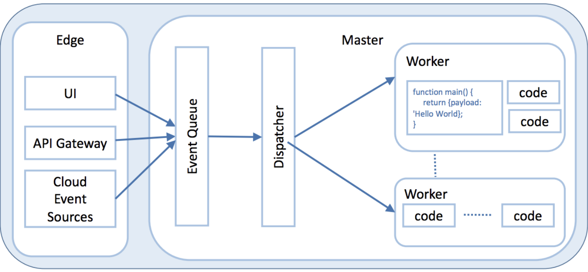
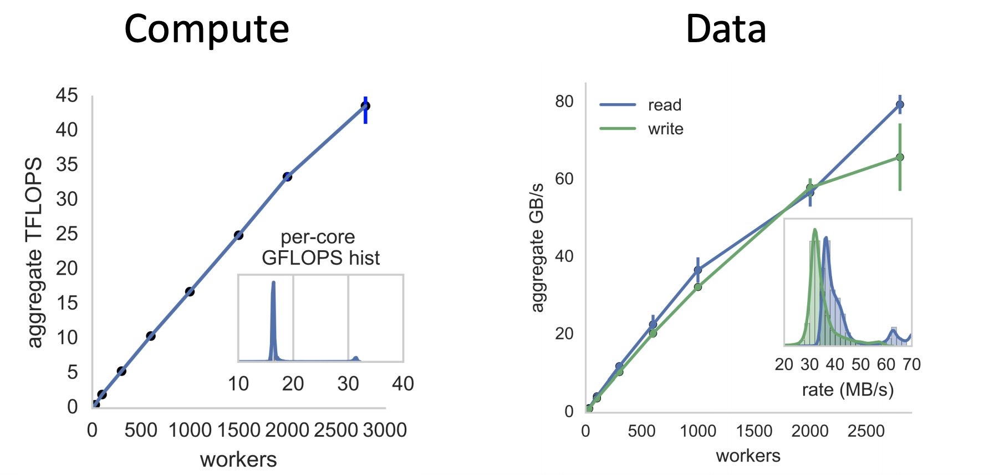

[Home](./README.md).
[Internet](./internet.md).
[Cloud Computing](./cloud_computing.md).
[Serverless](./serverless.md).
[AWS](./aws.md).
[Spark Overview](./spark_overview.md).
[Spark DataFrame & SQL API](./sparkAPI.md).
[Spark Internals](./spark_internals.md).
[Advanced Optimizations in Spark](spark_optimizations.md).
[Help/Resources](./resources.md).

### Serverless Solutions in the Cloud

Why care?
- Rapidly growing in popularity

> Change the way we write applications and expose new challenges

“ _The future of AWS_ ”
- Marvin Theimer,
    Distinguished Engineer at AWS
    
#### Basic Architecture

#### Core capability

1. Manage a set of user defined functions
2. Take an event sent over HTTP or received from an event source
3. Determine function(s) to which to dispatch the event
4. Find an existing instance of function or create a new one
5. Send the event to the function instance
6. Wait for a response
7. Gather execution logs
8. Make the response available to the user
9. Stop the function when it is no longer needed.

#### AWS lambdas
Serverless functions: typically read/write data from/to S3

- 300 seconds
- single-core (AVX2)
- 512 MB in /tmp
- 1.5GB RAM
- Python, Java, Node
- Sub-second billing: 3,600 threads for one second → 10¢

#### Lambda Scalability

