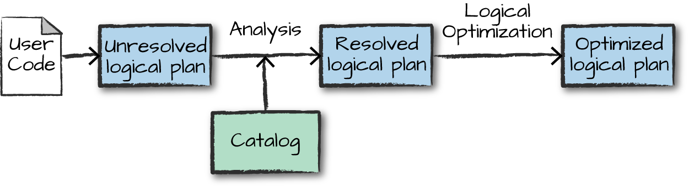
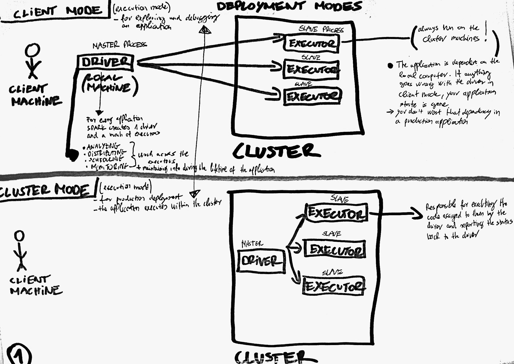
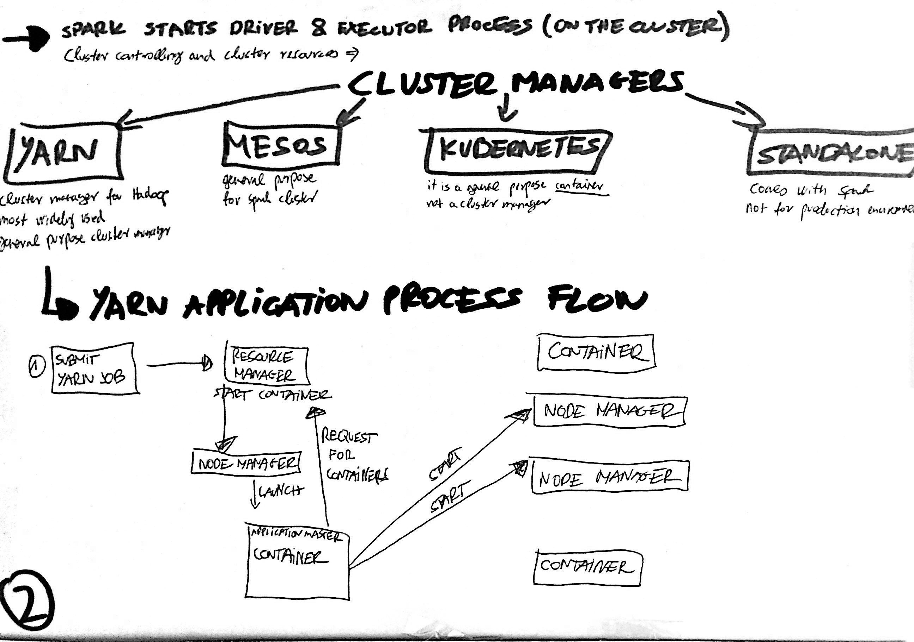
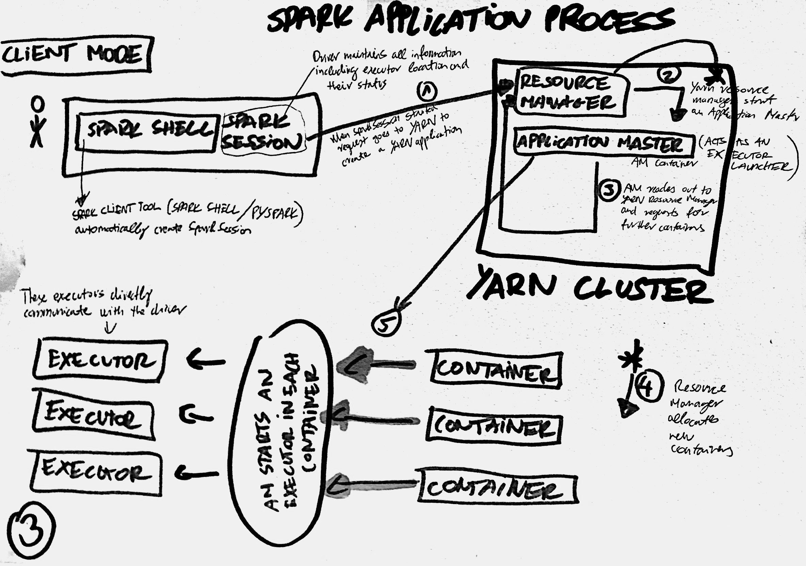
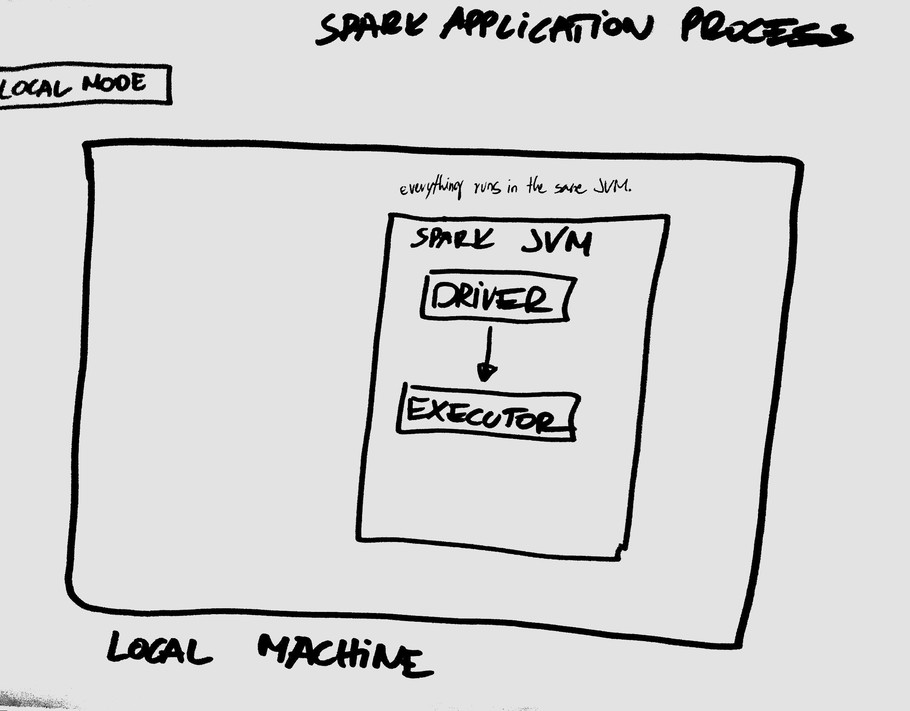
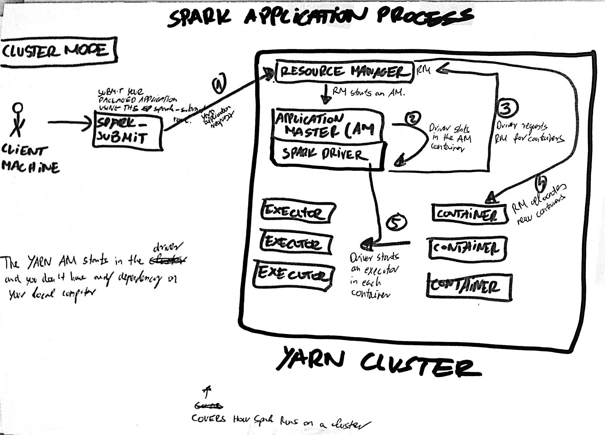

[Home](./README.md) | 
[Internet](./internet.md) | 
[AWS](./aws.md) | 
[Serverless](./serverless.md) | 
[Optional - Big Data History](./big_data_history.md) | 
[Spark Overview](./apachespark.md) | 
[Spark DataFrame API, SQL and Internals](spark-continued.md) |
<!--
[Spark Overview](./spark_overview.md).
[Spark DataFrame & SQL API](./sparkAPI.md).
[Spark Internals](./spark_internals.md).
-->
[Help/Resources](./resources.md).

###  Apache Spark DataFrame API, SQL and Internals - Summary & Resources

#### Recap video (Job, Stage, Task, Shuffle):

https://www.youtube.com/watch?v=a-yrOubLFn0&feature=youtu.be

#### Deep Dive into Spark SQL’s Catalyst Optimizer:

https://databricks.com/blog/2015/04/13/deep-dive-into-spark-sqls-catalyst-optimizer.html

#### Spark SQL, Built-in Functions:

https://spark.apache.org/docs/2.3.0/api/sql/index.html#dayofyear

#### PySpark SQL module

https://spark.apache.org/docs/latest/api/python/pyspark.sql.html#module-pyspark.sql.functions

#### Pyspark SQL Column Class

https://spark.apache.org/docs/latest/api/python/pyspark.sql.html#pyspark.sql.Column

#### Databricks Notebooks covered: 

- Spark Overview
- DataFrame Chapter 1
- DataFrame Chapter 2
- DataFrame Chapter 2 Lab 2
- Reading Data - [Parquet Video](https://parquet.apache.org/) + Databricks notebook
- DataFrame Chapter 4 (SQL and Visualization)
- Databricks - Internals - Catalyst Notebook

* * *

Notes - under development - (click to see)

  

  
- Spark is effectively a programming language of its own. Spark uses an engine called Catalyst
- Catalyst maintains its own type information through the planning and processing of work
   - This opens up execution optimizations
- Even if we use Spark's Structured APIs from Python or R, the majority of our manipulations will operate strictly on Spark types not Python types

The code we write gets submitted to Spark either through console or via a submitted job
- This code passes through the Catalyst Optimizer, which decides how the code should be executed and lays out a plan for doing so before, finally, the code is run and the result is returned to the user

#### Logical Planning
The first phase takes user code and converts it into a logical plan (optimized version of the user's set of expressions)
It does this by converting user code into an unresolved logical plan. The plan is unresolved because although your code might be valid, the tables and columns that it refers to might or might not exist. Spark uses the catalog, a repository of all table and DataFrame information to resolve columns and tables in the analyzer. The analyzer might reject the unresolved logical plan if the required column name does not exist in the catalog. If the analyzer can resolve it, the result is passed through the Catalyst Optimizer, a collection of rules that attempt to optimize the logical plan by pushing down predicates or selections. Packages can extend the Catalyst to include their own rules for domain-specific optimizations.

#### Physical Planning
After creating the optimized logical plan, Spark begins the physical planning process. The physical plan - often called Spark plan - specifies how the logical plan will execute on the cluster by generating different physical execution strategies and comparing them through a cost model. Upon selecting a physical plan Spark runs all of this code over RDDs.

* * *

### {Spark Architecture (To be updated w/ text + img)}

  

* * *

#### Sourcers/Credits:

  

