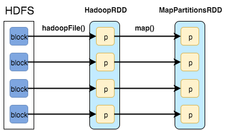

[Home](./README.md).
[Internet](./internet.md).
[Cloud Computing](./cloud_computing.md).
[Serverless](./serverless.md).
[AWS](./aws.md).
[Spark Overview](./spark_overview.md).
[Spark DataFrame & SQL API](./sparkAPI.md).
[Spark Internals](./spark_internals.md).
[Advanced Optimizations in Spark](spark_optimizations.md).
[Help/Resources](./resources.md).

## Spark Internals

#### Introduction
Spark is a generalized framework for distributed data processing providing functional API for manipulating data at scale, in-memory data caching and reuse across computations. It applies set of coarse-grained transformations over partitioned data and relies on dataset's lineage to recompute tasks in case of failures. Worth mentioning is that Spark supports majority of data formats, has integrations with various storage systems and can be executed on Mesos or YARN. 

*Powerful and concise API in conjunction with rich library makes it easier to perform data operations at scale. E.g. performing backup and restore of Cassandra column families in Parquet format:*
```
def backup(path: String, config: Config) {  
  sc.cassandraTable(config.keyspace, config.table)
    .map(_.toEvent).toDF()
    .write.parquet(path)
}

def restore(path: String, config: Config) {  
  sqlContext.read.parquet(path)
  .map(_.toEvent)
  .saveToCassandra(config.keyspace, config.table)
}
```
*Or run discrepancies analysis comparing the data in different data stores:*
```
sqlContext.sql {  
  """
     SELECT count()
     FROM cassandra_event_rollups
     JOIN mongo_event_rollups
     ON cassandra_event_rollups.uuid = cassandra_event_rollups.uuid
     WHERE cassandra_event_rollups.value != cassandra_event_rollups.value
  """.stripMargin
}
```

Spark is built around the concepts of Resilient Distributed Datasets and Direct Acyclic Graph representing transformations and dependencies between them.


Spark Application (often referred to as Driver Program or Application Master) at high level consists of SparkContext and user code which interacts with it creating RDDs and performing series of transformations to achieve final result. These transformations of RDDs are then translated into DAG and submitted to Scheduler to be executed on set of worker nodes.

#### RDD: Resilient Distributed Dataset
RDD could be thought as an immutable parallel data structure with failure recovery possibilities. It provides API for various transformations and materializations of data as well as for control over caching and partitioning of elements to optimize data placement. RDD can be created either from external storage or from another RDD and stores information about its parents to optimize execution (via pipelining of operations) and recompute partition in case of failure.

From a developer's point of view RDD represents distributed immutable data (partitioned data + iterator) and lazily evaluated operations (transformations). As an interface RDD defines five main properties:
```
//a list of partitions (e.g. splits in Hadoop)
def getPartitions: Array[Partition]

//a list of dependencies on other RDDs
def getDependencies: Seq[Dependency[_]]

//a function for computing each split
def compute(split: Partition, context: TaskContext): Iterator[T]

//(optional) a list of preferred locations to compute each split on
def getPreferredLocations(split: Partition): Seq[String] = Nil

//(optional) a partitioner for key-value RDDs
val partitioner: Option[Partitioner] = None  
```
Here's an example of RDDs created during a call of method sparkContext.textFile("hdfs://...") which first loads HDFS blocks in memory and then applies map() function to filter out keys creating two RDDs:



- HadoopRDD:
  - getPartitions = HDFS blocks
  - getDependencies = None
  - compute = load block in memory
  - getPrefferedLocations = HDFS block locations
  - partitioner = None
- MapPartitionsRDD
  - getPartitions = same as parent
  - getDependencies = parent RDD
  - compute = compute parent and apply map()
  - getPrefferedLocations = same as parent
  - partitioner = None
  
  RDD Operations
Operations on RDDs are divided into several groups:

#### Transformations
- apply user function to every element in a partition (or to the whole partition) 
- apply aggregation function to the whole dataset (groupBy, sortBy)
- introduce dependencies between RDDs to form DAG
- provide functionality for repartitioning (repartition, partitionBy)

#### Actions
- trigger job execution
- used to materialize computation results

#### Extra: persistence
- explicitly store RDDs in memory, on disk or off-heap (cache, persist)
- checkpointing for truncating RDD lineage
- Here's a code sample of some job which aggregates data from Cassandra in lambda style combining previously rolled-up data with the data from raw storage and demonstrates some of the transformations and actions available on RDDs:
```
//aggregate events after specific date for given campaign
val events =  
    sc.cassandraTable("demo", "event")
      .map(_.toEvent)                                
      .filter { e =>
        e.campaignId == campaignId && e.time.isAfter(watermark)
      }
      .keyBy(_.eventType)
      .reduceByKey(_ + _)                                        
      .cache()                                            

//aggregate campaigns by type
val campaigns =  
    sc.cassandraTable("demo", "campaign")
      .map(_.toCampaign)
      .filter { c => 
         c.id == campaignId && c.time.isBefore(watermark)
      }
      .keyBy(_.eventType)
      .reduceByKey(_ + _)
      .cache()

//joined rollups and raw events
val joinedTotals = campaigns.join(events)  
           .map { case (key, (campaign, event)) => 
             CampaignTotals(campaign, event) 
            }
           .collect()

//count totals separately
val eventTotals =  
    events.map{ case (t, e) => s"$t -> ${e.value}" }
    .collect()

val campaignTotals =  
    campaigns.map{ case (t, e) => s"$t -> ${e.value}" }
    .collect()
```


Here's a quick recap on the execution workflow before digging deeper into details: user code containing RDD transformations forms Direct Acyclic Graph which is then split into stages of tasks by DAGScheduler. Stages combine tasks which don’t require shuffling/repartitioning if the data. Tasks run on workers and results then return to client.


Here's a DAG for the code sample above. So basically any data processing workflow could be defined as reading the data source, applying set of transformations and materializing the result in different ways. Transformations create dependencies between RDDs and here we can see different types of them.

The dependencies are usually classified as "narrow" and "wide":


- Narrow (pipelineable)
  - each partition of the parent RDD is used by at most one partition of the child RDD
  - allow for pipelined execution on one cluster node
  - failure recovery is more efficient as only lost parent partitions need to be recomputed
- Wide (shuffle)
- multiple child partitions may depend on one parent partition
- require data from all parent partitions to be available and to be shuffled across the nodes
- if some partition is lost from all the ancestors a complete recomputation is needed

#### Splitting DAG into Stages
Spark stages are created by breaking the RDD graph at shuffle boundaries


- RDD operations with "narrow" dependencies, like map() and filter(), are pipelined together into one set of tasks in each stage operations with shuffle dependencies require multiple stages (one to write a set of map output files, and another to read those files after a barrier).
- In the end, every stage will have only shuffle dependencies on other stages, and may compute multiple operations inside it.    - The actual pipelining of these operations happens in the RDD.compute() functions of various RDDs

There are two types of tasks in Spark: `ShuffleMapTask` which partitions its input for shuffle and `ResultTask` which sends its output to the driver. The same applies to types of stages: `ShuffleMapStage` and `ResultStage` correspondingly.

#### Shuffle
- During the shuffle ShuffleMapTask writes blocks to local drive, and then the task in the next stages fetches these blocks over the network.

- Shuffle Write
  - redistributes data among partitions and writes files to disk
  - each hash shuffle task creates one file per “reduce” task (total = MxR)
  - sort shuffle task creates one file with regions assigned to reducer
  - sort shuffle uses in-memory sorting with spillover to disk to get final result
- Shuffle Read
  - fetches the files and applies reduce() logic
  - if data ordering is needed then it is sorted on “reducer” side for any type of shuffle
  
In Spark **Sort Shuffle** is the default one.
Sort Shuffle: 


- Incoming records accumulated and sorted in memory according their target partition ids
- Sorted records are written to file or multiple files if spilled and then merged
- index file stores offsets of the data blocks in the data file

#### Spark Components
- At 10K foot view there are three major components:


- Spark Driver
  - separate process to execute user applications
  - creates SparkContext to schedule jobs execution and negotiate with cluster manager
- Executors
  - run tasks scheduled by driver
  - store computation results in memory, on disk or off-heap
  - interact with storage systems
- Cluster Manager
  - Mesos
  - YARN
  - Spark Standalone
  
  Spark Driver contains more components responsible for translation of user code into actual jobs executed on cluster:
  
  
- SparkContext
  - represents the connection to a Spark cluster, and can be used to create RDDs, accumulators and broadcast variables on that cluster
  
- DAGScheduler
  - computes a DAG of stages for each job and submits them to TaskScheduler
  - determines preferred locations for tasks (based on cache status or shuffle files locations) and finds minimum schedule to run the jobs

- TaskScheduler
  - responsible for sending tasks to the cluster, running them, retrying if there are failures, and mitigating stragglers

- SchedulerBackend
  - backend interface for scheduling systems that allows plugging in different implementations(Mesos, YARN, Standalone, local)

- BlockManager
  - provides interfaces for putting and retrieving blocks both locally and remotely into various stores (memory, disk, and off-heap)

#### Memory Management in Spark
Executors run as Java processes, so the available memory is equal to the heap size. Internally available memory is split into several regions with specific functions.


- Execution Memory
  - storage for data needed during tasks execution
  - shuffle-related data
- Storage Memory
  - storage of cached RDDs and broadcast variables
  - possible to borrow from execution memory (spill otherwise)
  - safeguard value is 50% of Spark Memory when cached blocks are immune to eviction
- User Memory
  - user data structures and internal metadata in Spark
  - safeguarding against OOM
- Reserved memory
  - memory needed for running executor itself and not strictly related to Spark
