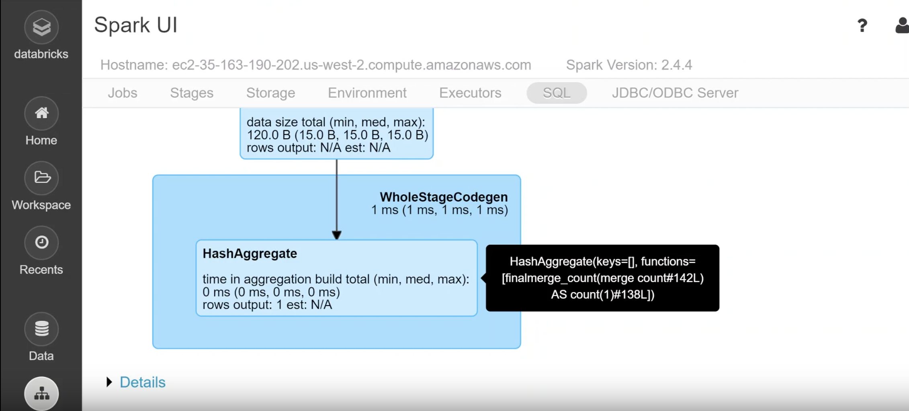
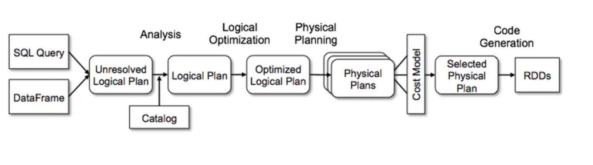

[Home](./README.md).
[Internet](./internet.md).
[Cloud Computing](./cloud_computing.md).
[Serverless](./serverless.md).
[AWS](./aws.md).
[Spark Overview](./spark_overview.md).
[Spark DataFrame & SQL API](./sparkAPI.md).
[Spark Internals](./spark_internals.md).
[Advanced Optimizations in Spark](spark_optimizations.md).
[Help/Resources](./resources.md).

## Advanced Optimizations in Spark

**1) Recap video. Click img!**

**2) Deep Dive into Spark SQL’s Catalyst Optimizer. Click img!**

* * *

### Spark Architecture

#### Sourcers/Credits:
To be completed
